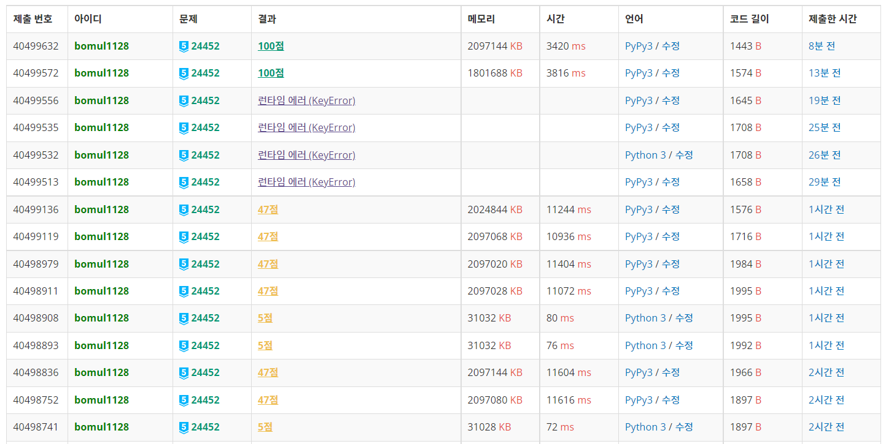

# 0315

오늘도 랜덤 문제 풀기

오늘의 랜덤 알고리즘 범위 : 분할 정복, 이분 매칭, DP, 분리 집합, 그리디 알고리즘


## :heavy_exclamation_mark:(오답) DNA 유사도 - [백준 2625](https://www.acmicpc.net/problem/2625) 

DP (LCS)

```python
from sys import stdin

input = stdin.readline

k = int(input())
n = int(input())
dna1 = ' ' + input().rstrip()
m = int(input())
dna2 = ' ' + input().rstrip()
dp = [[0] * (m + 1) for _ in range(n + 1)]
for i in range(1, n + 1):
    for j in range(1, m + 1):
        if dna1[i] == dna2[j]:
            pre = 0
            for t in range(k):
                pre = max(pre, dp[i - t][j - t])
            dp[i][j] = pre + 1
        else:
            dp[i][j] = max(dp[i][j - 1], dp[i - 1][j])
print(dp[-1][-1])
for x in range(1, n + 1):
    dp[x][0] = dna1[x]
for y in range(1, m + 1):
    dp[0][y] = dna2[y]
for line in dp:
    print(*line)
```

LCS랑 같은 로직으로 접근하려 했는데... '문자와 문자 사이가 최대 k만큼 차이나는' 을 구현하지 못했다. `for t in range(k)`부분이 나름 그걸 고려해서 해준건데, 정말 의미없는 부분이란 걸 나중에 알았다... 1시간 고민하다가 pass.


## 기왕 이렇게 된 거 암기왕이 되어라 - [백준 20156](https://www.acmicpc.net/problem/20156)

분리 집합, 오프라인 쿼리

```python
from sys import stdin
from sys import setrecursionlimit

setrecursionlimit(10 ** 6)
input = stdin.readline


def find(target):
    if p[target] == target:
        return target
    p[target] = find(p[target])
    return p[target]


def union(a, b):
    a = find(a)
    b = find(b)
    p[a] = p[b]


n, m, k = map(int, input().split())
p = list(range(n + 1))
line = list(map(int, input().split()))
for i in range(n):
    if line[i] > 0:
        p[i + 1] = line[i]
orders = [(0, 0)]
changed = [False] * (n + 1)
for _ in range(m):
    order = int(input())
    if changed[order] or p[order] == order:
        orders.append((0, 0))
    else:
        changed[order] = True
        orders.append((order, p[order]))
        p[order] = order
query = [list(map(int, input().split())) + [j] for j in range(k)]
ans = ["No;"] * k
query.sort()
stage = m
while query:
    r, x, y, idx = query.pop()
    while stage > r:
        z, w = orders[stage]
        union(z, w)
        stage -= 1
    if find(x) == find(y):
        ans[idx] = "Same Same;"
print('\n'.join(ans))
```

간만에 오프라인 쿼리 개념 문제다. 단순한 분리 집합 문제로 보인다. 게다가 union이 필요 없는? 근데 플레?? 하면서 문제를 풀었다. 그랬더니 시간 초과.  원인은 find 함수였던 거 같은데, 그래프의 분리가 필요하고 p에는 각 직속 멘토를 저장해야하므로 find를 아래와 같이 짰었다.

```python
def find(target):
    if p[target] == target:
        return target
    return find(p[target])
```

평소 하던 거랑 다르게, 최적화 부분인 ` p[target] = find(p[target])`이 제거됐다. 그러면 find 최적화가 필요하다는 것인데.... 그렇다면 p를 어떻게 해주냐??? 그래서 생각한 것이...

- p와 별개로 최적화된 값을 저장할 p_ver2를 만들어준다

  &#8594; 짜보려다가 실패. 다른 방법 찾아보자

- **역순으로 진행한다; 즉, 분리가 아닌 union으로 구현한다.**

  &#8594; find 함수의 최적화가 가능해진다!!

그래서 역순으로 진행해줬더니... 맞았습니다~~ 재밌는 문제였다.


## 짐 정리 - [백준 2569](https://www.acmicpc.net/problem/2569)

그리디 알고리즘

```python
from sys import stdin

input = stdin.readline


def sol(idx):
    if nums[idx] == result[idx]:
        return 0
    cycle = set()
    while nums[idx] not in cycle:
        cycle.add(nums[idx])
        idx = inv[nums[idx]]
    for num in cycle:
        nums[inv[num]] = num
    m = min(cycle)
    l = len(cycle)
    return sum(cycle) + min(m + result[0] * (l + 1), (l - 2) * m)


n = int(input())
nums = [int(input()) for _ in range(n)]
result = sorted(nums)
inv = {result[i]: i for i in range(n)}
ans = 0
for j in range(n):
    ans += sol(j)
print(ans)
```

이게 왜 플1?? 

흠... 설명할 것도 별로 없다. 머릿속에서 '어 이렇게 하면 되는 거 아닌가?'라고 드는 생각이 정답이다.

한 가지 주의할 점은, cycle을 구했을 때 짐 정리 방법을 정하는 것이다. 두 가지 방법이 있는데, `m = min(cycle)`과 `l = len(cycle)`일 때

- cycle 원소들로만 정리 : `sum(cycle) + (l - 2) * m`
- 매개 원소, 즉 원래 배열의 최솟값으로 정리 : `sum(cycle) + m + result[0] * (l + 1)`

그러므로 이 둘 중 최소 비용의 방법을 택해주면 된다.


## :diamond_shape_with_a_dot_inside:交易計画 (Trade Plan) - [백준 24452](https://www.acmicpc.net/problem/24452)

분리 집합, 오프라인 쿼리

```python
from sys import stdin
from sys import setrecursionlimit
from collections import defaultdict

setrecursionlimit(10 ** 6)
input = stdin.readline


def min_max(xx, yy):
    return min(xx, yy), max(xx, yy)


def find(parent, target):
    if parent[target] == target:
        return target
    parent[target] = find(parent, parent[target])
    return parent[target]


def union(parent, a, b):
    aa = find(parent, a)
    bb = find(parent, b)
    parent[aa] = bb


def transform(a, b):
    return min_max(state[a], state[b])


n, m, k = map(int, input().split())
edges = [tuple(map(int, input().split())) for _ in range(m)]
state = [0] + list(map(int, input().split()))
parents = list(range(n + 1))
for x, y in edges:
    if state[x] == state[y]:
        union(parents, x, y)
q = int(input())
query = [tuple(map(int, input().split())) for _ in range(q)]
parents_dict = defaultdict(dict)
for x, y in edges:
    parents_dict[transform(x, y)][find(parents, x)] = find(parents, x)
    parents_dict[transform(x, y)][find(parents, y)] = find(parents, y)
for x, y in edges:
    union(parents_dict[transform(x, y)], find(parents, x), find(parents, y))
for x, y in query:
    result = '0'
    t = transform(x, y)
    if t in parents_dict and find(parents, x) in parents_dict[t] and find(parents, y) in parents_dict[t]:
        if find(parents_dict[t], find(parents, x)) == find(parents_dict[t], find(parents, y)):
            result = '1'
    print(result)
```

일찍 자기로 했는데.... 문제 읽다가... 풀 수 있을 거 같아서... 3시간 동안 낑낑대다가.... 어느덧 새벽 6시다....

전형적인 분리 집합 문제였다. 그거 뿐이라면 다이아일 이유가 없겠지....

당연히 딕셔너리 접근을 생각했고, 오프라인 쿼리로 해야 시간 초과를 피할 수 있겠다는 생각을 했다. 그래서 처음엔 아래와 같이 풀었다.

```python
# 47점 짜리 코드
from sys import stdin
from sys import setrecursionlimit

setrecursionlimit(10 ** 6)
input = stdin.readline


def find(target):
    if parents[target] == target:
        return target
    parents[target] = find(parents[target])
    return parents[target]


def union(a, b):
    parents[find(a)] = parents[find(b)]


n, m, k = map(int, input().split())
edge = [tuple(map(int, input().split())) for _ in range(m)]
state = list(map(int, input().split()))
state_idx = set(state)
trans_edge = {}
for j in range(m):
    if trans_edge.get((state[edge[j][0] - 1], state[edge[j][1] - 1])):
        trans_edge[(state[edge[j][0] - 1], state[edge[j][1] - 1])].append(j)
    else:
        trans_edge[(state[edge[j][0] - 1], state[edge[j][1] - 1])] = [j]
q = int(input())
query = [tuple(map(int, input().split())) for _ in range(q)]
trans_query = {}
for j in range(q):
    if trans_query.get((state[query[j][0] - 1], state[query[j][1] - 1])):
        trans_query[(state[query[j][0] - 1], state[query[j][1] - 1])].append(j)
    else:
        trans_query[(state[query[j][0] - 1], state[query[j][1] - 1])] = [j]
ans = ['0'] * q
parents = list(range(n + 1))
for idx in state_idx:
    for edge_idx in trans_edge.get((idx, idx), []):
        union(*edge[edge_idx])
for idx in state_idx:
    for query_idx in trans_query.get((idx, idx), []):
        if find(query[query_idx][0]) == find(query[query_idx][1]):
            ans[query_idx] = '1'
p = parents[:]
for x, y in trans_query.keys():
    parents = p[:]
    for edge_idx in trans_edge.get((x, y), []):
        union(*edge[edge_idx])
    for edge_idx in trans_edge.get((y, x), []):
        union(*edge[edge_idx])
    for query_idx in trans_query.get((x, y), []):
        if find(query[query_idx][0]) == find(query[query_idx][1]):
            ans[query_idx] = '1'
    for query_idx in trans_query.get((y, x), []):
        if find(query[query_idx][0]) == find(query[query_idx][1]):
            ans[query_idx] = '1'
print('\n'.join(ans))
```

시간 초과로 만점을 못 받은 거라면... 당연히 이중 for문이 문제였을 거다. 어떻게든 살려보려고 손 보다가 결국 갈아엎었다.

풀이 중, `defaultdict`이라는 놈이 있던 게 생각났다. 코드가 한결 깔끔해졌다.

parents를 딥카피할 게 아니라, 딕셔너리로 저장해주면 좋겠다는 생각이 들었다. 그렇게 되면 굳이 쿼리와 엣지를 인덱스로 접근할 이유가 없어지면서, `trans_query`와 `trans_edge`를 만드는 과정이 필요 없어진다. 그래서 나온 코드는 아래와 같다.

```python
parents_dict = defaultdict(dict)
for x, y in edges:
    parents_dict[transform(x, y)][find(parents, x)] = find(parents, x)
    parents_dict[transform(x, y)][find(parents, y)] = find(parents, y)
```

즉,  `parents_dict[(state1, state2)] = (state1과 state2의 노드들의 최고 parent 노드만으로 이루어진 parent)`형태가 된다. 이제 각 edge들을, 해당하는 parent가 저장된 parents_dict내의 값을 찾아 이어주면 `parents_dict` 완성! 이제 쿼리들만 처리해주면서 답을 출력해주면 된다.



3시간 동안 수고했다...