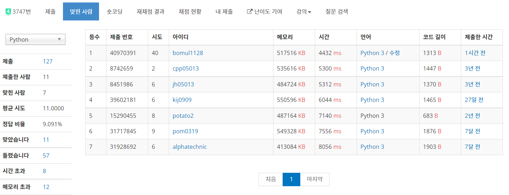

# 0325


## 완벽한 선거! - [백준 3747](https://www.acmicpc.net/problem/3747)

SCC(코사라주), 2 SAT

```python
from sys import setrecursionlimit, stdin

setrecursionlimit(10 ** 4)


def dfs(idx):
    if visited[idx]:
        return
    visited[idx] = True
    for adj in graph[idx]:
        if not visited[adj]:
            dfs(adj)
    stack.append(idx)


def dfs_inv(idx):
    if scc[idx]:
        return
    scc[idx] = component
    for adj in graph_inv[idx]:
        if not scc[adj]:
            dfs_inv(adj)


def check(arr):
    for j in range(1, n + 1):
        if arr[j] == arr[-j]:
            return 0
    return 1


input = map(int, stdin.read().split())
while True:
    try:
        n = next(input)
    except:
        break
    m = next(input)
    graph = [[] for _ in range(2 * n + 1)]
    graph_inv = [[] for _ in range(2 * n + 1)]
    for _ in range(m):
        x, y = next(input), next(input)
        graph[-x].append(y)
        graph[-y].append(x)
        graph_inv[x].append(-y)
        graph_inv[y].append(-x)
    stack = []
    visited = [False] * (2 * n + 1)
    for i in range(1, n + 1):
        if not visited[i]:
            dfs(i)
        if not visited[-i]:
            dfs(-i)
    del graph
    scc = [0] * (2 * n + 1)
    component = 0
    while stack:
        now = stack.pop()
        if not scc[now]:
            component += 1
            dfs_inv(now)
    del graph_inv
    print(check(scc))
```

**풀면서 정말 많이 화가 났던 문제다.**:angry: 2 SAT 문제는 완전히 이해하고 있다고 생각해서, 새로운 점이 없으면 코드 안 올리려 했는데... 이 문제는 쓸 수 밖에 없었다. 답 구하는 코드는 진작에 작성했지만, 하루동안 고통받았다. 



무려 40번이나 제출했다 ㅋㅋㅋㅋㅋㅋㅋㅋㅋㅋ

2 SAT 다 이해했다는 놈이 왜 이렇게 헤맸냐면... 데이터 들어오는 형식에 대한 설명이 없어서 그랬다. 문제에서 예시로 주는 Input 형태는,

```
3 3  +1 +2  -1 +2  -1 -3
2 3  -1 +2  -1 -2  +1 -2
2 4  -1 +2  -1 -2  +1 -2  +1 +2
2 8  +1 +2  +2 +1  +1 -2  +1 -2  -2 +1  -1 +1  -2 -2  +1 -1
```

같이 테스트 케이스가 한 줄에 다 나오는 형식이어서 평소하던 대로 하고 try except문으로 풀었는데, WA를 받았다. 그래서 '내 코드가 틀렸나?'라는 생각이 들어 한 30번 정도 온갖 곳을 고치면서 무지성 제출을 했지만, 역시 계속 WA. 그래서 내가 생각 못한 포인트가 있어서 틀렸겠거니... 해서 구글에 검색해서 맞은 사람 코드를 봤는데, 별 특별한 점 없이 그냥 평범한 2 SAT 문제로 해결했드라. 너무 답답해서 문제를 출제한 [SEERC](http://acm.ro/) 사이트에 들어가 출제 기록을 확인했더니, Input 형태가 아주 가관이었다. 예를 들면 위의 형태가 아니라,

```
3 3  
+1 +2  
-1 +2  
-1 -3

2 3  -1 +2  -1 -2  +1 -2
2 4  -1 +2  -1 -2  +1 -2  +1 +2


2 8  +1 +2  +2 +1  +1 -2  +1 -2  -2 +1  -1 +1  -2 -2  +1 -1
```

중간에 공백도 있고, 한 테스트 케이스가 한 줄에 안 나올 때도 있는... 파이썬을 위한 Input 형태가 아니었다. 평범하게 `input()`을 쓰면 1000줄이 훨씬 넘어가는 데이터를 읽느라 시간 초과가 뜨고, `sys.stdin.readline()`을 쓰면 `EOFError`와 `ValueError`를 구별하기 힘들어 함수 종료 조건 설정할 수 없었다. 그래서 10번 정도 더 헤매다가... C++로 푸신 [자손 9319님의 글](https://jason9319.tistory.com/199)을 보고 AC를 맞고, 이런 개떡 같은 Input을 python으로도 처리한 [jh05013님의 풀이](https://www.acmicpc.net/source/8451986)를 참고했다. 그랬더니, `read`와 `next`라는 신문물이 있었다...

- `read()`

  파일 전체의 내용을 하나의 문자열로 읽어오는 메소드

- `next()`

  Iterable한 데이터에 대해서 요소 한 개 씩 차례대로 보는 메소드

그래서 저 둘을 쓰면 아래와 같은 짓이 가능해진다.

```python
input = map(int, stdin.read().split())
while True:
    try:
        n = next(input)
    except:
        break
    ...
```

`sys.stdin.read().split()`이 전체 문서를 모든 공백, 줄바꿈을 기준으로 나눠주고, 길이가 얼마인지 신경 안 쓰고 `next`를 쓰면 차례대로 요소를 하나 씩 봐줄 수 있다! 자 그럼 이걸 쓰면 답을 구할 수 있겠지? 하니까 이번엔 MLE. 정말 가지가지하는 문제다. `set`과 `list` 자료 구조의 차이 때문에 나오는 문제였다. 중복되는 요소를 점검하는 것이 비효율적이라 생각해 그래프를 `defaultdict(set)`으로 했다가, 이중 리스트로 고쳐서 해결했다. 메모리 차이가 그렇게 많이 나는건가 싶어 찾아보니, [이런 글](https://stackoverflow.com/questions/10799417/performance-and-memory-allocation-comparison-between-list-and-set)을 찾았다. JAVA 얘기긴 하지만, set이 list보다 5.5배 정도 메모리를 많이 쓴단다. **유일성과 `in` 메소드를 쓸 것이 아니라면 `list`를 쓰는게 이득**이라고 한다. 이 문제 덕분인지 때문인지 뭔 수식어를 붙여할 지 모르겠지만, 많은 걸 배웠다.

암튼 이거 풀고 SCC 문제 손에 잡히는 대로 풀어버렸다.

