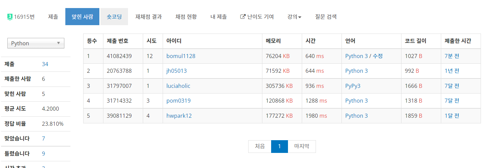
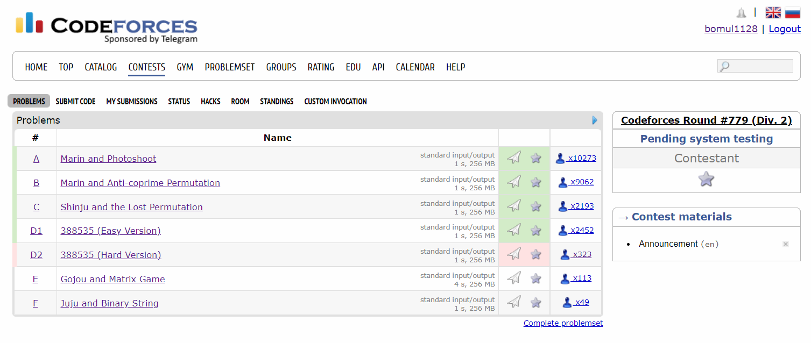

# 0327


## [2022 숭고한 연합 알고리즘 Open Contest](https://www.acmicpc.net/contest/view/786)

그리디 느낌의 문제가 많았다. 5시간 짜리 대회였지만 한 2시간 정도? 만 참여했다. 최종 순위는 180여 명 중 25위. 언제나 그랬듯이 기록할 가치가 있는 문제만 기록하자.

#### :heavy_exclamation_mark:(TLE) F. 노트 조각

다익스트라, 경로 역추적

```python
import heapq
from sys import stdin, setrecursionlimit

input = stdin.readline
setrecursionlimit(10 ** 6)


def trace(route, check):
    if note[route[-1] - 1]:
        check -= 1
    if check == 0:
        print(len(route))
        print(*reversed(route))
        exit()
    for pre, extra in graph_inv[route[-1]]:
        if dist[pre] + extra == dist[route[-1]]:
            trace(route + [pre], check)


INF = float('inf')
n, m = map(int, input().split())
graph = [[] for _ in range(n + 1)]
graph_inv = [[] for _ in range(n + 1)]
for _ in range(m):
    x, y, d = map(int, input().split())
    graph[x].append((y, d))
    graph_inv[y].append((x, d))
dist = [INF] * (n + 1)
dist[1] = 0
heap = [(0, 1)]
while heap:
    d, now = heapq.heappop(heap)
    if now == n:
        break
    if dist[now] == d:
        for adj, ex in graph[now]:
            if dist[adj] > ex + d:
                dist[adj] = ex + d
                heapq.heappush(heap, (dist[adj], adj))
del graph, heap
note = list(map(int, input().split()))
trace([n], sum(note))
print(-1)
```

단순하게 다익스트라로 접근해서 역추적해주면 되는 문제 같아 보였는데, 효율 좋은 다른 풀이가 있는 모양이다. 아니면 파이썬을 위한 문제가 아니라던가... 제출 기록은 남아있으니 대회 끝나고 다시 도전해야겠다.

#### J. 이차 함수

페르마 소정리, 분할 정복을 활용한 거듭 제곱


```python
from sys import stdin
from math import gcd

input = stdin.readline


def power(x, y):
    ans = 1
    while y > 0:
        if y % 2:
            ans = (ans * x) % div
        x = (x * x) % div
        y //= 2
    return ans


n = int(input())
a, b = map(int, input().split())
p = (n * n - 1) * (b - a) ** 3
q = 6 * n * n
d = gcd(p, q)
p //= d
q //= d
div = 10 ** 9 + 7
ans = (power(q, div - 2) * p) % div
print(ans)
```

이차 함수와 직선 사이의 넓이 공식을 활용하는 문제였다. 대칭성에 의해 모든 구간의 길이를 같게 나눌 때 볼록 다각형의 넓이가 최소가 될 것이다. 넓이 계산에서 주의할 점은 나눗셈 연산을 하지 않는 것이다. 그래야 기약 분수의 분모 분자를 얻어낼 수 있을테니까?
$$
\text{area} = {(b-a)^3 \over 6} - {({b-a \over n})^3 \over 6} \times n
={(b-a)^3\times(n^2-1) \over 6n^2}
$$
위의 식대로 넓이를 구해줬다. 약분은 귀찮아서 math 라이브러리의 gcd 모듈을 활용했다. 그 다음이 핵심인데, q * v 가 p와 mod 연산 결과가 같게 되는 v를 찾아야 한다. div가 10<sup>9</sup>+7, 즉 소수여서 페르마 소정리로 v를 구해줄 수 있다. 또한, 문제 조건에서 v가 항상 존재한다고 했으니 걱정없이 연산만 해주면 된다.
$$
v \equiv pq^{-1} \equiv pq^{\text{div} - 2} \mod {\text{div}}
$$
당연히 거듭 제곱 연산은 분할 정복으로 구현해줬다. 결과는 1트 AC. 아쉽게도 10분 정도 차이로 풀이 1등을 놓쳤다.. ㅠ


## 호텔 관리 - [백준 16915](https://www.acmicpc.net/problem/16915)

SCC

```python
from sys import stdin, setrecursionlimit

setrecursionlimit(10 ** 6)
input = stdin.readline


def add_edge(a, b):
    graph[a].append(b)
    graph[b].append(a)
    graph[-a].append(-b)
    graph[-b].append(-a)


def dfs(idx):
    if scc[idx]:
        return
    scc[idx] = component
    if scc[-idx] == component:
        print(0)
        exit()
    for adj in graph[idx]:
        if not scc[adj]:
            dfs(adj)


n, m = map(int, input().split())
on_off = [0] + list(map(int, input().split()))
connection = [[] for _ in range(n + 1)]
for si in range(1, m + 1):
    k, *room_idx = map(int, input().split())
    for ri in room_idx:
        connection[ri].append(si)
graph = [[] for _ in range(2 * m + 1)]
for ri in range(1, n + 1):
    x, y = connection[ri]
    if on_off[ri]:
        add_edge(x, y)
    else:
        add_edge(x, -y)
scc = [0] * (2 * m + 1)
component = 0
for i in range(1, m + 1):
    if not scc[i]:
        component += 1
        dfs(i)
    if not scc[-i]:
        component += 1
        dfs(-i)
print(1)
```

코드포스 대회까지 시간이 좀 붕 떠서 백준 좀 풀기로 했다. 각 방에 연결된 스위치가 정확히 2개 씩 있다. 즉, 2 SAT 같이 논리형 문제로 풀 수 있다. 근데 그래프 조건이 모든 논리형 간선이 쌍방향이길래, 굳이 DFS를 두 번 탐색하지 않아도 될 것 같아 한 번만 하도록 어레인지 해보았다.



결과는 대성공! 


## [Codeforces Round #779 (Div. 2)](https://codeforces.com/contests/1658)

대회 풍년이다~ 오늘 코드포스 대회는 4 sol을 목표로 해보자.



이것도 4 sol이라 할 수 있나?? 싶긴 한데 일단 4문제 풀어서 536등. 역대 최고 등수다~~ D2 거의 갈피를 잡은 것 같은데, 시간이 모자랐다..

#### :heavy_exclamation_mark:(WA) D2. 388535 (Hard Ver.)

``` python
from sys import stdin
 
input = stdin.readline
 
for _ in range(int(input())):
    l, r = map(int, input().split())
    t = [0] * 17
    for num in range(l, r + 1):
        for bit in range(17):
            if (1 << bit) & num:
                t[bit] += 1
            else:
                t[bit] -= 1
    nums = list(map(int, input().split()))
    k = [0] * 17
    for num in nums:
        for bit in range(17):
            if (1 << bit) & num:
                k[bit] += 1
            else:
                k[bit] -= 1
    ans = 0
    for bit in range(17):
        if k[bit] != t[bit]:
            ans += (1 << bit)
        elif k[bit] == t[bit] == 0:
            ans += (1 << bit) & l
    print(ans)
```

같은 수로 xor 연산을 하니까, target 구간과 0, 1의 갯수를 똑같이 해주자는 느낌으로 코드를 짰는데... 아무래도 마지막의 `elif` 부분 로직에 문제가 있는 것 같다.


