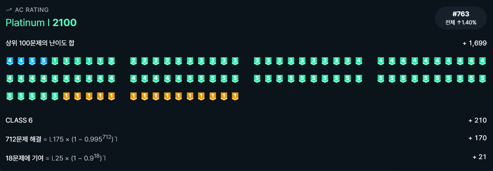

# 0328


## :heavy_exclamation_mark:(MLE) 문 - [백준 2416](https://www.acmicpc.net/problem/2416)

2 SAT, 코사라주

```python
from sys import stdin, setrecursionlimit

input = stdin.readline
setrecursionlimit(10 ** 6)


def dfs(idx):
    if not scc[idx]:
        return
    scc[idx] = False
    for adj in graph[idx]:
        if scc[adj]:
            dfs(adj)
    stack.append(idx)


def dfs_inv(idx):
    if scc[idx]:
        return
    scc[idx] = component
    if scc[-idx] == component:
        print('IMPOSSIBLE')
        exit()
    for adj in graph[-idx]:
        if not scc[-adj]:
            dfs_inv(-adj)


def check(arr, l):
    for j in range(1, l + 1):
        if arr[j] > arr[-j]:
            print(1)
        else:
            print(0)


m, n = map(int, input().split())
graph = [[] for _ in range(2 * n + 1)]
for _ in range(m):
    a, sa, b, sb = map(int, input().split())
    if not sa:
        a = -a
    if not sb:
        b = -b
    graph[-a].append(b)
    graph[-b].append(a)
stack = []
scc = [True] * (2 * n + 1)
for i in range(1, n + 1):
    if scc[i]:
        dfs(i)
    if scc[-i]:
        dfs(-i)
component = 0
while stack:
    now = stack.pop()
    if not scc[now]:
        component += 1
        dfs_inv(now)
del graph
check(scc, n)
```

진짜 줄일만큼 줄인 거 같은데... 그래프와 역방향 그래프가 겹치는 걸 찾아 둘이 합쳐줬고, 기존의 `visited`와 `scc`도 합쳐줬다. 그래도 메모리 초과.... 더 줄일 아이디어가 떠오르질 않는다. 일단 잠시 손 떼고 있어야 할 듯


 ## 지구 정육면체설 - [백준 7686](https://www.acmicpc.net/problem/7687)

기하?

```python
from sys import stdin

input = stdin.readline

while True:
    lx, ly, lz, x, y, z = map(int, input().split())
    if lx == ly == lz == 0:
        break
    if x == 0 or y == 0 or z == 0:
        print(x * x + y * y + z * z)
    elif x == lx:
        a = (lx + y) * (lx + y) + z * z
        b = (lx + z) * (lx + z) + y * y
        c = (lx + lz - z) * (lx + lz - z) + (lz + y) * (lz + y)
        d = (lx + ly - y) * (lx + ly - y) + (ly + z) * (ly + z)
        print(min(a, b, c, d))
    elif y == ly:
        a = (ly + x) * (ly + x) + z * z
        b = (ly + z) * (ly + z) + x * x
        c = (ly + lz - z) * (ly + lz - z) + (lz + x) * (lz + x)
        d = (ly + lx - x) * (ly + lx - x) + (lx + z) * (lx + z)
        print(min(a, b, c, d))
    elif z == lz:
        a = (lz + y) * (lz + y) + x * x
        b = (lz + x) * (lz + x) + y * y
        c = (lz + lx - x) * (lz + lx - x) + (lx + y) * (lx + y)
        d = (lz + ly - y) * (lz + ly - y) + (ly + x) * (ly + x)
        print(min(a, b, c, d))
```

별 거 없다. 전개도 그려서 가능한 케이스를 찾아주면 된다. `c`와 `d`를 처음엔 생각 못해줘서 WA를 받았다가, 꼭 두 면을 통과하지 않아도 최소가 되는 케이스가 있다는 것을 알아차려 추가해줬다. 기하 문제 점수 달달하다~~


## 게시판 구멍 막기 - [백준 2414](https://www.acmicpc.net/problem/2414)

이분 매칭

```python
from sys import stdin

input = stdin.readline


def dfs(idx):
    for adj in graph[idx]:
        if visited[adj]:
            continue
        visited[adj] = True
        if match[adj] == 0 or dfs(match[adj]):
            match[adj] = idx
            return 1
    return 0


n, m = map(int, input().split())
board = [input().strip() for _ in range(n)]
row = [[0] * m for _ in range(n)]
col = [[0] * m for _ in range(n)]
rn = 0
cn = 0
for i in range(n):
    for j in range(m):
        if board[i][j] == '*' and not row[i][j]:
            rn += 1
            jj = j
            while jj < m and board[i][jj] == '*':
                row[i][jj] = rn
                jj += 1
for j in range(m):
    for i in range(n):
        if board[i][j] == '*' and not col[i][j]:
            cn += 1
            ii = i
            while ii < n and board[ii][j] == '*':
                col[ii][j] = cn
                ii += 1
graph = [[] for _ in range(rn + 1)]
for i in range(n):
    for j in range(m):
        if row[i][j]:
            graph[row[i][j]].append(col[i][j])
ans = 0
match = [0] * (cn + 1)
for i in range(1, rn + 1):
    visited = [False] * (cn + 1)
    ans += dfs(i)
print(ans)
```

이분 매칭 문제 한참 많이 풀 때 아이디어가 떠오르지 않아 넘어갔던 문제인데, 오늘 다시 보니 풀린다 ㅎㅎ [돌멩이 제거](https://www.acmicpc.net/problem/1867) 문제와 다르게, 막으면 안 되는 곳이 생겼다. 이걸 어떻게 예외 처리를 해주지 고민했는데... 단순하게 행 방향과 열 방향으로 각각 구멍을 넘버링을 해주고(`row`와 `col`), 그 다음 같은 칸에 있는 숫자끼리 그래프를 이어주면 이분 그래프 형태로 나타낼 수 있다. 이분 그래프에서 성립하는 강력한 성질 알고 있지?

> Bipartite graph에서, 최소 버텍스 커버의 수는 최대 매칭의 수와 같다.

이 문제에서는 최소 버텍스 커버의 수가 구해야 하는 수이다. 커버할 버텍스를 고른다는 것은, 해당 행 또는 열의 부분에 테이핑을 한다고 생각하면 되겠다. 이제 문제는 단순한 이분 매칭 문제처럼 풀어주면 끝!


## N-Rook - [백준 1760](https://www.acmicpc.net/problem/1760)

이분 매칭

```python
from sys import stdin

input = stdin.readline


def dfs(idx):
    for adj in graph[idx]:
        if visited[adj]:
            continue
        visited[adj] = True
        if match[adj] == 0 or dfs(match[adj]):
            match[adj] = idx
            return 1
    return 0


n, m = map(int, input().split())
board = [list(map(int, input().split())) for _ in range(n)]
rn = 0
cn = 0
row = [[0] * m for _ in range(n)]
col = [[0] * m for _ in range(n)]
for i in range(n):
    for j in range(m):
        if board[i][j] == 0 and not row[i][j]:
            rn += 1
            jj = j
            while jj < m and board[i][jj] != 2:
                if board[i][jj] == 0:
                    row[i][jj] = rn
                jj += 1
for j in range(m):
    for i in range(n):
        if board[i][j] == 0 and not col[i][j]:
            cn += 1
            ii = i
            while ii < n and board[ii][j] != 2:
                if board[ii][j] == 0:
                    col[ii][j] = cn
                ii += 1
graph = [[] for _ in range(rn + 1)]
for i in range(n):
    for j in range(m):
        if not board[i][j]:
            graph[row[i][j]].append(col[i][j])
match = [0] * (cn + 1)
ans = 0
for i in range(1, rn + 1):
    visited = [False] * (cn + 1)
    ans += dfs(i)
print(ans)
```

바로 앞의 문제랑 매우 비슷하다. 넘버링하는 방식만 조금 바꿔주고 이분 매칭으로 해주면 된다.



드디어 플 1 도착! 다이아까지 단 100점!!
