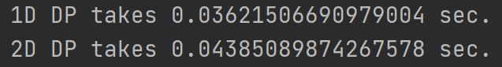
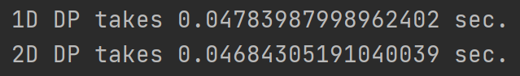

# 0329


## 영과일 학회방 - [백준 16276](https://www.acmicpc.net/problem/16726)

이분 매칭

```python
from sys import stdin

input = stdin.readline


def dfs(idx):
    for adj in graph[idx]:
        if visited[adj]:
            continue
        visited[adj] = True
        if match[adj] == 0 or dfs(match[adj]):
            match[adj] = idx
            return 1
    return 0


n, m = map(int, input().split())
board = [list(input().strip()) for _ in range(n)]
bn = 0
wn = 0
for i in range(n):
    for j in range(m):
        if board[i][j] == '.':
            if (i - j) % 2:
                bn += 1
                board[i][j] = bn
            else:
                wn += 1
                board[i][j] = wn
        else:
            board[i][j] = 0
graph = [[] for _ in range(bn + 1)]
dx = [1, -1, 0, 0]
dy = [0, 0, 1, -1]
for i in range(n):
    for j in range(m):
        if board[i][j] and (i - j) % 2:
            for d in range(4):
                ni = i + dx[d]
                nj = j + dy[d]
                if 0 <= ni < n and 0 <= nj < m and board[ni][nj]:
                    graph[board[i][j]].append(board[ni][nj])
match = [0] * (wn + 1)
ans = bn + wn
for i in range(1, bn + 1):
    visited = [False] * (wn + 1)
    ans -= dfs(i)
print(ans)
```

**점수 올리기 효자 종목 TOP 3 - 분리 집합, 이분 매칭, 강한 연결 요소** 사랑해~~

흑백 체스판 구조로 보드를 색칠하고, 이분 매칭을 하면 최대 매칭의 수는 사용 가능한 최대 2개 짜리 타일의 수가 된다. 그러면 전체 채워야하는 칸에서 그만큼 빼주면 필요한 타일의 수가 나온다. EZ.


## 이차원 리스트 호출 시간 테스트

문제 풀다가, 이차원 dp 조작을 해서 푼 문제가 1차원 dp로 새로운 리스트를 생성해 해결하는게 더 빠르다는 것을 확인했다. 값만 호출하면 되는 거 같은데, 그게 아닌가 보다.

```python
import time

dp1 = [0] * 10000
dp2 = [[0] * 10000 for _ in range(10000)]

start = time.time()
for i in range(10 ** 6):
    dp1[3] = 1
print(f'1D DP takes {time.time() - start} sec.')

start = time.time()
for i in range(10 ** 6):
    dp2[1][1] = 1
print(f'2D DP takes {time.time() - start} sec.')
```



1차원 dp는 `dp1[0]`, 2차원 dp는 `dp2[0][0]`으로 호출하면 1차원 dp 호출할 때 1비트를 덜 사용해서 차이가 날 수도 있겠다는 생각을 했다. 그래서 나름 같은 조건을 맞춰주겠다고 1차원 dp는 `dp1[1]`, 2차원 dp는 `dp2[1][1]`로 수정해줬다.(이게 맞는 논리인지는 모르겠다 ㅋㅋ) 올바른 테스트 방법인지는 모르겠지만, 일단 시간 차이가 난다. 같은 코드로 한 10번 정도 시행해봤는데,  0.005 sec 정도 1차원 dp가 항상 더 빨랐다.

```python
# 테스트 Ver.2
import time

dp1 = [0] * 10000
dp2 = [[0] * 100 for _ in range(100)]

start = time.time()
for i in range(10 ** 6):
    dp1[3] = 1
print(f'1D DP takes {time.time() - start} sec.')

start = time.time()
for i in range(10 ** 6):
    dp2[1][1] = 1
print(f'2D DP takes {time.time() - start} sec.')
```

어쩌면 2차원 dp의 크기가 너무 커서 차이가 생겼나 싶어, 크기도 맞춰주었다. 물론, 2차원 dp가 내부 리스트 표현 때문에 메모리는 더 잡아먹겠지만... 세세한 건 넘어가고. 같은 코드로 한 10번 정도 시행해봤는데,  이것 또한 역시 0.005 sec 정도 1차원 dp가 항상 더 빨랐다. 흠.... 그래서 한 가지 가설을 세워봤다.

> (추측) 2차원 DP를 `DP[X][Y]` 형태로 호출할 때, `DP[X]` 가 한 번 호출되고, 그 다음 거기서 `Y`번째 요소를 호출한다?

흠... 해당 가설을 토대로 총 호출되는 데이터의 크기를 맞춰주자. 한 번 갱신할 때 9900개의 데이터를 호출되는 꼴이다.(가설이 맞다면)

```python
# 테스트 최종
import time

dp1 = [0] * 9900
dp2 = [[0] * 99 for _ in range(99)]

start = time.time()
for i in range(10 ** 6):
    dp1[3] = 1
print(f'1D DP takes {time.time() - start} sec.')

start = time.time()
for i in range(10 ** 6):
    dp2[1][1] = 1
print(f'2D DP takes {time.time() - start} sec.')
```



해냈다. 시간이 거의 비슷해졌다. 오히려 1차원 DP가 더 느릴 때도 있었다. 가설이 맞는 듯??


