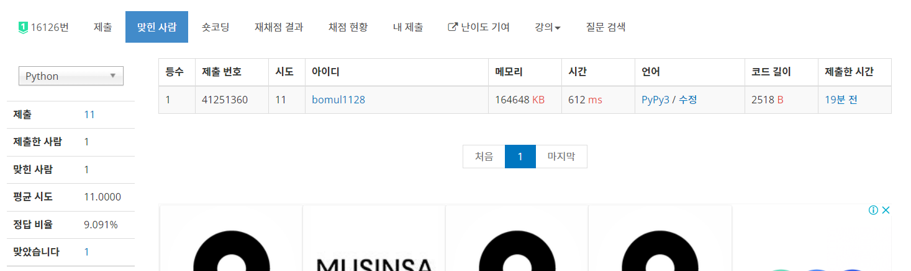

# 0331


## 동아리방 확장 - [백준 16126](https://www.acmicpc.net/problem/16126)

이분 매칭

```python
from sys import stdin, setrecursionlimit

input = stdin.readline
setrecursionlimit(10 ** 4)


def sol():
    n, m = map(int, input().split())
    board = [list(map(int, input().split())) for _ in range(n)]
    bn, wn = 0, 0
    for i in range(n):
        for j in range(m):
            if (i - j) % 2:
                if board[i][j] == 2:
                    bn += 2
                    board[i][j] = -bn
                elif board[i][j] == 3:
                    bn += 1
                    board[i][j] = bn
                elif board[i][j] == 4:
                    board[i][j] = 0
                else:
                    print("HOMELESS")
                    return
            else:
                if board[i][j] == 2:
                    wn += 2
                    board[i][j] = -wn
                elif board[i][j] == 3:
                    wn += 1
                    board[i][j] = wn
                elif board[i][j] == 4:
                    board[i][j] = 0
                else:
                    print("HOMELESS")
                    return
    if bn != wn:
        print("HOMELESS")
        return
    graph = [[] for _ in range(bn + 1)]
    dx = [1, -1, 0, 0]
    dy = [0, 0, 1, -1]
    for x in range(n):
        for y in range(m):
            if (x - y) % 2 and board[x][y]:
                now = board[x][y]
                for d in range(4):
                    nx = x + dx[d]
                    ny = y + dy[d]
                    if 0 <= nx < n and 0 <= ny < m and board[nx][ny]:
                        neighbor = board[nx][ny]
                        if now > 0:
                            if neighbor > 0:
                                graph[now].append(neighbor)
                            else:
                                graph[now].append(-neighbor)
                                graph[now].append(-neighbor - 1)
                        else:
                            if neighbor > 0:
                                graph[-now - 1].append(neighbor)
                                graph[-now].append(neighbor)

    def dfs(idx):
        for adj in graph[idx]:
            if not visited[adj]:
                visited[adj] = True
                if not match[adj] or dfs(match[adj]):
                    match[adj] = idx
                    return 1
        return 0

    match = [0] * (wn + 1)
    for i in range(1, bn + 1):
        visited = [False] * (wn + 1)
        if not dfs(i):
            print("HOMELESS")
            return
    print("HAPPY")
    return


sol()
```

자려고 했는데... 풀이가 번뜩였다. 격자끼리 연결하는 구조이니 이분 매칭으로 해결 가능할 것 같았다. 가능한 방의 종류는 `4`, `3-3`, `3-2-3` 셋 중 하나이다. 즉 숫자 중 0 또는 1이 있다면 그대로 `HOMELESS`를 출력해주면 된다. 이제 이분 그래프를 그려보자! 격자 구조에서의 이분 그래프 느낌으로 출발하는데, `3`이 나온 방은 상하좌우의 `3`의 방과 간선 하나를 그려주고, `2`와는 2개의 간선을 이어준다. `2`가 나온 방은 상하좌우 `3`의 방과 간선을 2개 그려준다. `4`는 그 자체로 방 하나 완성이니 그대로 남겨둔다. 그 다음 모든 점에 대해서 이분 매칭을 해주어 한 개라도 매칭이 안 되면 `HOMELESS`를 출력한다.... 였지만 1트 AC는 하지 못했다. **그러다 흰색과 검정색의 개수가 다를 수도 있다는 생각이 떠올랐다.** 그래서 역방향 그래프를 그려주고 역방향 이분 매칭을 해줬는데, TLE. 고민하던 중, 너무 어렵게 생각했단 걸 알았다. 그냥 `bn == wn`을 체크만 해주면 되는 거였다 ㅋㅋ 

```python
    if bn != wn:
        print("HOMELESS")
        return
```

그리해서 위 부분을 추가해주니 AC를 받았다.



게다가 유일하게 파이썬으로 푼 사람이 되었다. 와하하~~


## 에어컨 설치 - [백준 20294](https://www.acmicpc.net/problem/20294)

이분 매칭

```python
from sys import stdin

input = stdin.readline


def dist(p1, p2):
    res = 0
    for i in range(3):
        res += abs(p1[i] - p2[i])
    return res


def dfs(idx):
    for adj in graph[idx]:
        if not visited[adj]:
            visited[adj] = True
            if not match[adj] or dfs(match[adj]):
                match[adj] = idx
                return 1
    return 0


n = int(input())
bn = 0
wn = 0
black = {}
white = {}
for _ in range(n):
    x, y, z = map(int, input().split())
    if (x + y + z) % 2:
        bn += 1
        black[(x, y, z)] = bn
    else:
        wn += 1
        white[(x, y, z)] = wn
graph = [[] for _ in range(bn + 1)]
cnt = [1] * (bn + wn + 1)
for bk, bv in black.items():
    for wk, wv in white.items():
        if dist(bk, wk) == 1:
            graph[bv].append(wv)
            cnt[bv] = 0
            cnt[-wv] = 0
match = [0] * (wn + 1)
ans = sum(cnt) - 1
for i in range(1, bn + 1):
    visited = [False] * (wn + 1)
    ans += dfs(i)
print(ans)
```

3차원 구조지만, 격자판 구조와 비슷하게 생각해줄 수 있다. 이 문제의 정답은 단순히 최소 버텍스 커버, 즉 최대 매칭의 수가 아니라, disjoint vertices도 생각해줘야 한다. 그래서 `cnt` 리스트를 추가해 간선으로 이어지지 않은 점들의 개수를 구해줬다.


## 비숍2 - [백준 2570](https://www.acmicpc.net/problem/2570)

이분 매칭

```python
from sys import stdin, setrecursionlimit

input = stdin.readline
setrecursionlimit(10 ** 4)


def dfs(idx):
    for adj in graph[idx]:
        if visited[adj]:
            continue
        visited[adj] = True
        if not match[adj] or dfs(match[adj]):
            match[adj] = idx
            return 1
    return 0


n = int(input())
ln = 0
ld_board = [[0] * n for _ in range(n)]
rn = 0
rd_board = [[0] * n for _ in range(n)]
for _ in range(int(input())):
    x, y = map(int, input().split())
    ld_board[x - 1][y - 1] = -1
    rd_board[x - 1][y - 1] = -1
for i in range(n):
    for j in range(n):
        if not ld_board[i][j]:
            ln += 1
            ii, jj = i, j
            while ii < n and jj < n and not ld_board[ii][jj]:
                ld_board[ii][jj] = ln
                ii += 1
                jj += 1
        if not rd_board[i][j]:
            rn += 1
            ii, jj = i, j
            while ii < n and jj >= 0 and not rd_board[ii][jj]:
                rd_board[ii][jj] = rn
                ii += 1
                jj -= 1
graph = [[] for _ in range(ln + 1)]
for i in range(n):
    for j in range(n):
        if ld_board[i][j] > 0:
            graph[ld_board[i][j]].append(rd_board[i][j])
match = [0] * (rn + 1)
ans = 0
for i in range(1, ln + 1):
    visited = [False] * (rn + 1)
    ans += dfs(i)
print(ans)
```

룩 배치하기랑 비슷한데, 대각선으로 넘버링을 해준다. 이후 이분 매칭 과정은 동일하다.


## Unique Solution - [백준 19647](https://www.acmicpc.net/problem/19647)

이분 매칭

```python
from sys import stdin, setrecursionlimit

input = stdin.readline
setrecursionlimit(10 ** 4)


def dfs(idx):
    for adj in graph[idx]:
        if visited[adj]:
            continue
        visited[adj] = True
        if not match[adj] or dfs(match[adj]):
            match[adj] = idx
            return 1
    return 0


def dfs_inv(idx):
    for adj in graph[idx][::-1]:
        if visited[adj]:
            continue
        visited[adj] = True
        if not match_inv[adj] or dfs_inv(match_inv[adj]):
            match_inv[adj] = idx
            return 1
    return 0


n = int(input())
graph = [[] for _ in range(n + 1)]
for i in range(n):
    m, *ans = map(int, input().split())
    graph[i + 1] = ans
match = [0] * (n + 1)
ans = 0
for i in range(1, n + 1):
    visited = [False] * (n + 1)
    ans += dfs(i)
if ans == n:
    match_inv = [0] * (n + 1)
    for i in range(1, n + 1):
        visited = [False] * (n + 1)
        dfs_inv(i)
    if match == match_inv:
        print(1)
        result = [0] * (n + 1)
        for i in range(1, n + 1):
            result[match[i]] = i
        print(*result[1:])
    else:
        print('-1')
else:
    print('-1')
```

이분 매칭의 해가 유일한 지 체크해야 하는 문제였다. 일단 이분 매칭 돌려 결과를 받고, 그래프 간선을 역순으로 이분 매칭을 다시 돌려 서로 결과가 같으면 해가 유일하다고 판단해 코드를 작성했다. 내 판단이 맞았는지 바로 AC !