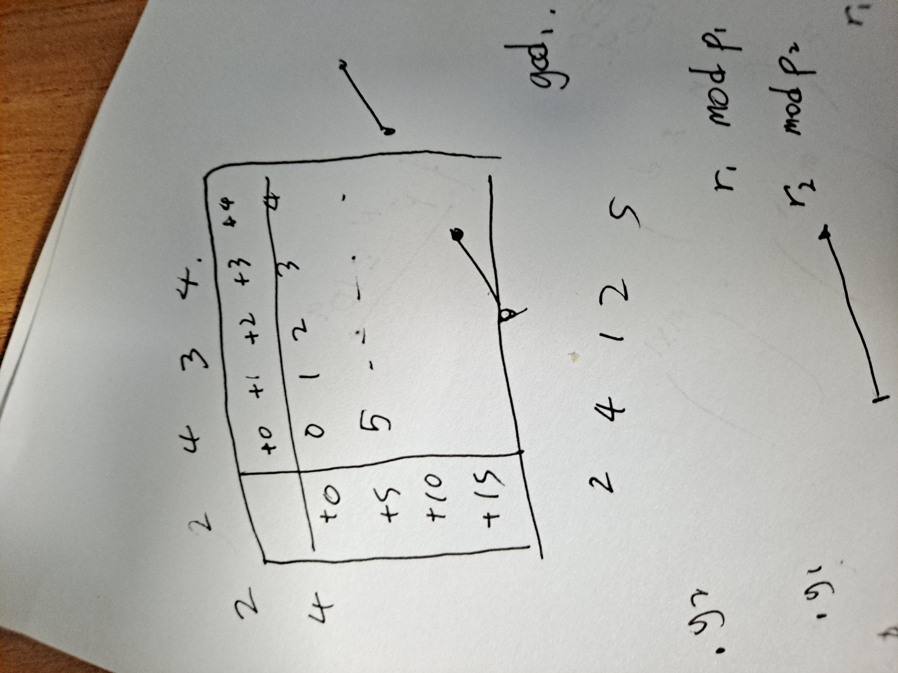

# 10월 10일

사실 Today I learned 가 아니라 for Twenty day I Learned 라 카더라.

20일동안 백준 레이팅이 15점이나 올랐다. 슬슬 일이 익숙해지면서 알고리즘 고민할 시간이 조금씩 생기는 느낌? 다이아 2가 머지 않았다

코드 첨부는 굳이 해야하나 하는 생각이 들었다. 백준에 가서 확인하면 되는 거? 아?닌가? 그래서 오늘부터 TIL 양식을 조금은 바꿔보려 한다. 뭐 다음 꺼는 언제 쓸 지 모르겠지만...


## GCD - [백준 19329](https://www.acmicpc.net/problem/19329)

> 폴라드 로, 무작위화

**TIL에 이건 꼭 써야지 했던 문제1이다.** 처음 문제를 봤던 게 7월 달이고, 10월 6일에 해결했으니 거의 100일 간 고민한 셈이다. 문제 지문 내용이 워낙 간결하다 보니, 지하철로 회사 오고 갈 때 고민하기 딱 좋은 문제였다. 그러다 저번주 수요일 퇴근길에 감을 잡았다!

n개의 숫자 중에 k개를 제외하여 남은 숫자들의 최대공약수를 최대로 하는 문제이다. 문제 조건에 k가 n/2 보다 작거나 같다는 조건이 상당히 중요한 문제였다. 완전 탐색으로 푼다면 nCk의 풀이가 나올텐데, 당연히 시간 초과다.

옛날에 풀었던 백설공주와 난쟁이 문제와 비슷하게, 문제를 조금 바꿔서 생각해보자. 숫자를 임의로 한 개를 골랐을 때, 이 숫자가 최대공약수를 최대로 하는 n-k 개 수들의 집합에 속할 확률은 1/2 이상이다. 그렇다면, 랜덤 숫자 하나를 뽑고, 그 수가 속하는 최대공약수의 최대를 구하는 일을 t번 반복해서 그 중 최대를 답이라고 주장했을 때, 이 주장이 참을 확률은? 1-(1/2)^t 가 된다. 즉 20번 정도 반복해서 얻은 답은 매우 높은 확률로 실제 답과 일치하게 된다!

따라서 문제를 어떻게 풀 수 있냐면,

1. 숫자 하나 고른다. 이 수의 소인수를 폴라드 로를 이용해 뽑아준다.
2. 고른 숫자 하나와 배열 내 숫자의 최대공약수를 모두 구해준다. 중복 포함 총 n개 나올 것이다.
3. 각각 최대공약수의 약수들을 모두 카운팅해주고, 모든 약수들 중 n-k 이상 등장했으면서 가장 큰 수가 답이 된다.
4. 1~3을 20번 반복.

3번 과정이 조금 난감했는데,

```Python
    for p in div_p:
        for s in entry:
            if not s % p:
                cnt[s // p] = cnt.get(s // p, 0) + cnt[s]
                if s // p not in checker:
                    checker.add(s // p)
                    entry.append(s // p)
    for key, value in cnt.items():
        if key > ans and value >= l - m:
            ans = key
```

위와 같이 해결했다. 시간 초과를 피하기 위해 list와 set을 동시에 관리한 것이 유효했지 싶다. 약수 카운팅 과정은 코드 보면 이해 될 듯.


그 결과 파이썬 임에도 가장 빠른 풀이가 탄생했다! 슬쩍 보니 무작위화로 해결하신 분들은 다들 20번보다 많은 횟수를 돌리시긴 했다 ㅋㅋㅋ

얼마만에 다이아3 해결인지 모르겠다. 이분 매칭 문제 이후 오랜만인듯.


## 뱀 - [백준 10875](https://www.acmicpc.net/problem/10875)

> 구현

요새 빡 구현 문제를 잘 안 해서 감이 떨어졌을 거 같아 구현 중 랜덤 플레 문제를 풀어보기로 했다. 하고 나서 엄청 후회했다. 엣지 케이스 찾는 데 40분이 걸렸으니...

뱀이 상하좌우로 움직이는데, 이동하는 경로의 모든 점 정보를 저장해 체크하면 시간 초과일 것이다. 뱀이 직선 경로로 움직이다가 90도 씩 방향을 바꾸는 것을 이용해, 코너링 지점만 차례대로 저장해주자. 그러면 모든 이동 경로 정보를 담고 있는 리스트가 완성된다. 그러면, 임의의 두 직선 경로가 겹치는 구간이 있는지 체크하는 문제로 바뀐다!

여기까진 쉽게 했는데, 구현이 생각보다 쉽지 않았다. 격자판을 나가는 경우와, 1) 교차하는 경우, 2) 직선이 포개지는 경우? 모두 고려해주어야 했다. 이 직선이 포개지는 경우를 생각 못 해 오랜 시간이 걸렸다...

간만에 빡 구현 문제를 풀었더니 성격이 나빠지는 기분이다...


## A Bug’s Life - [백준 7535](https://www.acmicpc.net/problem/7535)

> DFS

2 SAT 안 한지 좀 됐네~ 싶어 카테고리 들어갔더니, 골드 문제가 껴있었다. 2 SAT 자체로 플레 문제일텐데, 뭔가 싶어 문제를 풀었더니 2 SAT는 오버킬인? 문제였다.

두 정점 간에 상호 작용을 했다면 간선을 이어주고, 그래프의 정점들을 2가지 색깔로 모두 색칠했을 때 이웃하는 두 정점의 색깔이 모두 다르도록 할 수 있는지 묻는 문제로 생각할 수 있다. 즉, 홀수 사이클이 존재하는지 여부만 체크해주면 된다. DFS 한 번 돌리면 끝.

풀자마자 문제 기여에 DFS만 넣어서 제출했더니 2 SAT 태그가 사라졌다. 이게 맞지 ㅇㅇ


## 피타고라스의 정리 - [백준 5051](https://www.acmicpc.net/problem/5051)

> FFT

mod를 취한 피타고라스 쌍이 몇 개 존재하는지 묻는 문제였다. 제곱수들 mod 값을 카운팅하고, 이 카운팅한 녀석을 제곱해주면 거의 문제가 끝난다. `arr`를 제곱한 애, `memo`를 제곱 안 한 애라고 하면,

```Python
ans = 0
for i in range(m):
    ans += (arr[i] + arr[m + i]) * memo[i]
    if not i % 2:
        ans += memo[i // 2] * memo[i]
    if not (m + i) % 2:
        ans += memo[(m + i) // 2] * memo[i]
print(ans // 2)
```

위와 같은 방법으로 답을 구할 수 있다. 주의할 점은 (a, b, c) 쌍에서 a=b 인 경우를 찾아 잘 처리해줘야 한다. 전형적인 FFT 문제라 큰 어려움 없이 해결했다.


## 숏코딩 - [백준 15956](https://www.acmicpc.net/problem/15956)

> 문자열, 분리 집합

**TIL에 이건 꼭 써야지 했던 문제2.**

여러 조건문이 주어지고, 이 조건문들과 동치인 가장 짧은 조건문을 구하는 문제였다. 연산자는 == 과 != 중 하나이고, 비교 대상은 정수 또는 변수명이었다. 조건을 분기 별로 잘 나누어서 해결해야 한다. 편의를 위해 wrong이라는 함수를 사용했다.

```Python
def wrong():
    print('0==1')
    exit()
```

#### `A==B` 조건문

- A, B 모두 정수라면, 두 수가 같을 땐 그냥 넘어가고, 다르다면 wrong을 실행
- A, B 중 하나만 정수라면, 변수에 값이 저장되어 있는지 체크해 그 값과 같다면 그냥 넘어가고, 다르다면 wrong 실행. 저장이 안 되어있다면 새로 저장해주기. 
- A, B 모두 변수라면, A와 B에 저장되어 있는 값이 있는지 체크해 그 값이 같다면 그냥 넘어가고, 다르다면 wrong 실행. 하나라도 값이 저장되어 있지 않다면 같은 변수들끼리 union. 

#### `A!=B` 조건문

- A, B 모두 정수라면, 두 수가 다를 땐 그냥 넘어가고, 같다면 wrong을 실행
- A, B 중 하나만 정수라면, 변수에 값이 저장되어 있는지 체크해 그 값과 다르다면 그냥 넘어가고, 같다면 wrong 실행. 저장이 안 되어있다면 A와 B를 잇는 간선 그리기.
- A, B 모두 변수라면, A와 B에 저장되어 있는 값이 있는지 체크해 그 값이 다르다면 그냥 넘어가고, 같다면 wrong 실행. 하나라도 값이 저장되어 있지 않다면 A와 B를 잇는 간선 그리기.

이를 구현하기 위해 분리 집합을 사용했다.

```Python
def toIntOrStr(t):
    if t[0] == '-' or t.isdigit():
        return int(t)
    else:
        return t


def find(t):
    if not parent.get(t):
        parent[t] = t
        return t
    if t == parent[t]:
        return t
    parent[t] = find(parent[t])
    return parent[t]


exprs = list(input().split('&&'))
diff = []
parent = {}
for expr in exprs:
    if '==' in expr:
        x, y = map(toIntOrStr, expr.split('=='))
        px, py = find(x), find(y)
        if isinstance(px, int):
            if isinstance(py, int):
                if px != py:
                    wrong()
            else:
                parent[py] = px
        else:
            parent[px] = py
    else:
        x, y = map(toIntOrStr, expr.split('!='))
        px, py = find(x), find(y)
        if px == py:
            wrong()
        diff.append((px, py))
```

이 과정을 다 하고 나면 답을 출력해야 한다. `==`의 정당성은 실시간으로 다 체크했으니, `!=`의 정당성을 추가로 체크해주자.

```Python
real_diff = set()
for x, y in diff:
    px, py = find(x), find(y)
    if px == py:
        wrong()
    if isinstance(px, str) or isinstance(py, str):
        px, py = str(px), str(py)
        if px > py: # 중복된 간선을 없애기 위해 필요함.
            px, py = py, px
        real_diff.add((px, py))
```

위의 과정을 거치면 그려야하는 간선들이 얼추 정해졌다. `real_diff` 간선은 A와 B 집합에서 문자 길이가 가장 짧은 a와 b로 `a!=b`로 표현해주고, 같은 집합 C 내의 변수들끼리는 그 집합에서 문자 길이가 가장 짧은 c에 대해 `c==c_i` 식으로 표현해주면 끝! 이 때 완전 항등식인 경우, `1==1`을 출력하도록 예외 처리를 해줘야 한다.

코딩하면서 분기들을 어떻게 나눠야할지 고민하는 과정이 굉장히 재밌었다! 비슷한 문제들 어디 없나..


## 그림 그리기 - [백준 14707](https://www.acmicpc.net/problem/14707)

> FFT, CRT

**TIL에 이건 꼭 써야지 했던 문제3**

엉겁결에 식을 유도해서 풀었는데, 알고 보니 이게 중국인의 나머지 정리, CRT 였다 ㅋㅋ

문제 풀이 과정을 먼저 살펴보자. 격자판에서 차례대로 색칠을 하는데, 각 색깔의 총 면적을 구하는 문제였다.



좀 그림이 개떡같긴 한데, 암튼 저런 식의 표를 생각해보자. 각각의 행과 열에 값을 부여해 그 두 값을 더하면 그 요소가 몇 번째인지 구할 수 있게 할 수 있다. 몇 번째 요소인지 알면 어떤 색깔로 칠해야 하는지 정할 수 있다.

```Python
arr = [0] * n
arr2 = [0] * n
row = list(map(int, input().split()))
col = list(map(int, input().split()))
for i in range(r):
    arr[(i * c) % d] += row[i]
for i in range(c):
    arr2[i % d] += col[i]
fft(arr)
fft(arr2)
for i in range(n):
    arr[i] *= arr2[i]
fft(arr, inv=True)
ans = 0
for i in range(d):
    print(arr[i] + arr[i + d])
```

하지만, 결과는 틀렸습니다.. 실수한 건가 싶어 다른 방법으로도 올려봤는데 계속 틀렸다고 나왔다. 그러다가, 현재 사용하고 있는 FFT 구현체에서 div 값이 답의 범위인 10^18 보다 작은 게 눈에 들어왔다. 고민하다가, 10^9보다 큰 2개의 서로 다른 소수로 FFT를 하고, 그 값을 이용해 진짜 값을 구하자는 생각이 들었다. 구하는 수를 x, p1으로 나눴을 때 나머지를 r1, p2로 나눴을 때의 나머지를 r2라 하자. 이 때 p1, p2는 10^9보다 큰, fft에서 사용한 원시근을 가지는 소수들이다. 나는 2281701377 과 1092616193 를 사용했다.

$$
x = p_1 \times a + r_1 \equiv r_2 \mod p2 \\
\therefore a \equiv (r_2 - r_1) / p_1 \equiv (r_2 - r_1) \times p_1^{p_2 - 2} \mod p_2
$$

이 때 a의 범위를 생각해보면, 10^9 보다 작으므로 p2보다 작은 음이 아닌 정수이다. 즉, 위 식의 마지막 부분((r2-r1) ~) 을 p2로 나눈 값은 a 와 일치하게 되는 것이다! 그러므로, 아래와 같은 방법으로 답을 구할 수 있다.

```Python
p1, p2 = 2281701377, 1092616193
for i in range(d):
    r1 = arr[i] + arr[i + d]
    r2 = memo[i] + memo[i + d]
    ans = (((r2 - r1) * pow(p1, p2 - 2, p2)) % p2) * p1 + r1
    print(ans)
```

수식 유도를 얼마만에 한 건지 모르겠다 ㅋㅋㅋ 여러모로 재밌는 문제였다.
