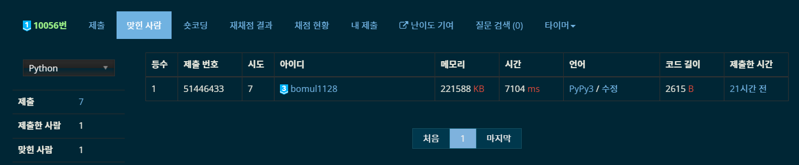

# 11월 8일

어제 다이아1 문제를 풀고, 오늘도 다이아1 문제를 풀어버렸다. 그래서 TIL을 안 쓸 수가 없었다.

얼마만에 쓰는 평일 TIL인지...


## Metal Processing Plant - [백준 10056](https://www.acmicpc.net/problem/10056)

> 2SAT, 이분 탐색, 분리 집합

어제 푼 문제이다. 자려고 누운 뒤 유튜브 보다가 갑자기 [추천 영상](https://www.youtube.com/watch?v=PMBN5hZA9LI)에 떴다. 보니까 이미 북마크 설정해놓고 풀어보려던 문제였어서 금방 이해가 됐다. 앞에 한 5분 보다가 풀이가 생각나서 바로 코딩을 시작했다. 이게 새벽 2시.

하지만 괜히 다이아1이 아니었다. 생각보다 빡셌다. 다 짜고 제출해보니 새벽 4시 반... 시간 초과가 났다.

``` Python
# TIL
n = int(input())
edges = {0: []}
for i in range(1, n):
    for j, c in enumerate(map(int, input().split())):
        if edges.get(c):
            edges[c].append((i, i + j + 1))
        else:
            edges[c] = [(i, i + j + 1)]
if n < 3:
    print(0)
    exit()
key = list(edges.keys())
key.sort()
ans = float('inf')
for p in range(len(key)):
    start = 0
    end = p
    while start <= end:
        mid = (start + end) // 2
        graph = [[] for _ in range(2 * n + 1)]
        for i in range(mid + 1, p + 1):
            for x, y in edges[key[i]]:
                graph[x].append(-y)
                graph[y].append(-x)
        for i in range(p + 1, len(key)):
            for x, y in edges[key[i]]:
                graph[x].append(-y)
                graph[-x].append(y)
                graph[y].append(-x)
                graph[-y].append(x)
        visited = [False] * (2 * n + 1)
        stack = []
        for i in range(1, n + 1):
            if not visited[i]:
                dfs(i)
            if not visited[-i]:
                dfs(-i)
        scc = [0] * (2 * n + 1)
        component = 0
        while stack:
            now = stack.pop()
            if not scc[now]:
                component += 1
                dfs_inv(now)
        flag = True
        for i in range(1, n + 1):
            if scc[i] == scc[-i]:
                flag = False
                break
        if flag:
            if ans > key[mid] + key[p]:
                ans = key[mid] + key[p]
            end = mid - 1
        else:
            start = mid + 1
print(ans)
```

여기까지 어떤 풀이를 했는지 살펴보자. 영상에서 설명해준 부분은, D<sub>A</sub>보다 크거나 같은 D<sub>B</sub>에 대해서, D<sub>B</sub>의 값을 고정한다. 그 다음 D<sub>A</sub>를 0 ~ D<sub>B</sub> 범위에서 이분 탐색을 해준다. 각각의 탐색에서, 해당 D<sub>A</sub>와 D<sub>B</sub>를 만족하는 두 집합이 존재하는지 판별한다. 이건 2SAT로 구현이 가능하다. 

```Python
for i in range(mid + 1, p + 1):
    for x, y in edges[key[i]]:
        graph[x].append(-y)
        graph[y].append(-x)
for i in range(p + 1, len(key)):
    for x, y in edges[key[i]]:
        graph[x].append(-y)
        graph[-x].append(y)
        graph[y].append(-x)
        graph[-y].append(x)
```

간선은 이런 식으로 그려주면 된다. 간선 정보를 보고 양 끝 점이 어느 집합에 속해있는 구조여야 하는지 생각해보면 쉽게 떠올릴 수 있다.

하지만 안타깝게도 시간 초과가 나왔다. 왜냐하면, 

> 모든 간선(n^2)에 대해 이분 탐색 (2SAT, O(n^2))을 log(n^2) 만큼 한다.

즉 시간복잡도가 O(n^4 * log n)가 된다. n이 200 밖에 안 돼서 이런 점을 고려하지 않고 구현했다... 

줄일 수 있는 부분을 찾아봐야하는데,

1. 여기서 2SAT는 O(n^2) 고정이다.
2. 여기서 이분 탐색을 최적화할 방법은 딱히 없는 듯 하다.
3. 따라서 모든 간선을 살펴보는 것이 시간 초과의 원인이다.

그렇다면 간선을 어디까지 살펴보는 것이 좋을 지 생각해보자. 쉽게 생각했을 때, 방법은 2가지 있을 것이다.

1. D<sub>A</sub>의 범위에 제한을 둘 수 있다.
2. D<sub>B</sub>의 범위에 제한을 둘 수 있다.

D<sub>A</sub>는 D<sub>B</sub>에 대해 종속적?(더 좋은 표현이 생각나지 않는다. 암튼 독립적이지 않다)이기 때문에, D<sub>B</sub>의 범위에 제한을 두는 것이 맞을 것 같다.

최대 스패닝 트리를 그린다고 생각해보자. 여기에 최대 스패닝 트리에서 사용하지 않은 간선 중에, 그리면 홀수 사이클이 생기는, 그 중에 가장 비싼 간선 e를 생각해보자. 이 때, **홀수 사이클 내부의 간선 중 하나는 반드시 A 또는 B 안에 포함되게 된다.** 즉, 간선 e의 비용을 c라 했을 때, c는 D<sub>B</sub>보다 반드시 작거나 같다! 이제 간선 비용을 역순으로 탐색을 하면서, 간선을 사용하다가 홀수 사이클이 생기는 순간까지만 탐색을 하면 된다! 그리고 이건 간선을 n개만 살피게 되므로, O(n^3 * log n)의 풀이가 탄생한다.

그럼 이제 MST + e를 어떻게 그릴지 생각해봐야 한다. 평소하던대로 크루스칼 때리면 되지만, 홀수 사이클이 생기는 순간을 판별해야 한다. 내가 사용한 방법은, 1 ~ n^2 까지에 대해서만 그리는게 아니라, -1 ~ -n^2에 대해서도 트리를 한꺼번에 그리는 것이다. 역순으로 간선을 살펴볼 때, 해당 간선(a to b)을 MST + e에 사용한다면, a와 b의 색깔은 다르게 칠해져야 한다.(홀수 사이클 설명할 때 주로 나오는 색깔 개념을 사용하겠다.) 즉, a와 -b, 그리고 b와 -a를 union 해주면 된다. 이렇게 MST + e를 그리다가, a와 -a가 같은 parents를 가질 때 종료하면 된다.

여기까지만 하면 될 줄 알았는데... 또 시간 초과가 나왔다. 이론은 완벽하거늘... 파이썬이라 당했다... 이런 생각하다가, 문제점을 찾았다. 같은 비용의 간선들의 집합들을 모두 살펴봤는데 MST + e 그래프에 유의미한 간선은 그리지 않았을 때, 즉 union이 일을 안 했을 때는 해당 비용을 탐색할 필요가 없었다! 그래서, union - 이분탐색 - find 순으로 탐색을 진행하도록 수정했다.

```Python
... # 기본 설정 코드
for p in range(len(key) - 1, -1, -1):
    flag = False
    for x, y in edges[key[p]]:
        fx, mfx, fy, mfy = find(x), find(-x), find(y), find(-y)
        if fx != mfy:
            parents[mfy] = fx
            flag = True
        if fy != mfx:
            parents[mfx] = fy
            flag = True
    if flag:
      ... # 이분 탐색 2SAT 
      for i in range(1, n + 1):
          if find(i) == find(-i):
              print(ans)
              exit()
print(ans)      
```

그리고 AC를 받아냈다!



추가로, 파이썬으로 유일하게 정답을 맞춘 사람이 됐다. 애초에 파이썬으로 다1을 제출하는 바보가 나밖에 없었지만... 그래도 기분은 좋다 ㅎㅎ

2SAT 북마크 문제를 해결해서, 북마크에 있던 다른 2SAT 문제(다음 문제)를 고민하면서 어제 잠들었는데, 생각보다 할만할 것 같다는 생각이 들어 오늘 도전했다. 


## Dev, Please Add This! - [백준 14737](https://www.acmicpc.net/problem/14737)

> 2SAT, 구현

올해 초 4월달 쯤?에 처음으로 봤던 문제다. DFS로 풀어보려다가 아무리 생각해도 시간 초과날 것 같아서 관뒀다. 그러다가 가로 요소와 세로 요소로 나눈 뒤 두 요소 간의 상관 관계를 그래프로 나타내 2SAT로 할 수 도 있겠다는 생각을 했다. 하지만 구현이 그리 쉽진 않았다...

그리고 오늘 퇴근하자마자 계속 붙잡고 구현했더니 2시간에 걸려 완성했다. 물론 중간에 딴짓 좀 했다.

가로, 세로 요소를 넘버링하는 건 이분 매칭 때 자주하던 일이다.

```Python
n, m = map(int, input().split())
board = [list(input()) + ['#'] for _ in range(n)] + [['#'] * m]
rn = [[0] * m for _ in range(n)]
cn = [[0] * m for _ in range(n)]
rc = 0
cc = 0
star = []
for i in range(n):
    for j in range(m):
        if board[i][j] != '#':
            if board[i][j] == 'O':
                ii, ij = i, j
            elif board[i][j] == '*':
                star.append((i, j))
            if rn[i][j] == 0:
                rc += 1
                nj = j
                while nj < m and board[i][nj] != '#':
                    rn[i][nj] = rc
                    nj += 1
            if cn[i][j] == 0:
                cc += 1
                ni = i
                while ni < n and board[ni][j] != '#':
                    cn[ni][j] = cc
                    ni += 1
```

그 다음은 각 요소 간의 관계를 나타내야 한다.

```Python
... # 앞의 내용들
graph = [[] for _ in range(rc + cc + 1)]
graph_inv = [[] for _ in range(rc + cc + 1)]
for i in range(n):
    for j in range(m):
        if board[i][j] != '#':
            if board[i - 1][j] == '#' or board[i + 1][j] == '#':
                graph[rc + cn[i][j]].append(rn[i][j])
                graph_inv[rn[i][j]].append(rc + cn[i][j])
            if board[i][j - 1] == '#' or board[i][j + 1] == '#':
                graph[rn[i][j]].append(rc + cn[i][j])
                graph_inv[rc + cn[i][j]].append(rn[i][j])
```

상하좌우에 벽이 있을 때만 방향 전환이 가능하다는 점을 이용해 `graph`와 `graph_inv`를 그려줬다. pure SCC 코사라주를 할 거라 정말 오랜만에 역방향 그래프도 그려줬다. 이제 SCC를 통해 `graph_scc`를 완성해준 뒤,

```Python
def make_can_go(idx):
    if can_go[idx]:
        return can_go[idx]
    temp = {idx}
    for adj in graph_scc[idx]:
        temp.update(make_can_go(adj))
    can_go[idx] = temp
    return temp


... # 앞 내용들
can_go = [set() for _ in range(component + 1)]
graph = [[] for _ in range(component * 2 + 1)]
for i in range(1, component + 1):
    make_can_go(i)
    for j in range(1, i):
        if j not in can_go[i] and i not in can_go[j]:
            graph[i].append(-j)
            graph[j].append(-i)
del graph_scc
```

이제 2SAT에 사용해줄 `graph`를 그려주기 시작하면 된다. 함수 재활용하려고 변수명을 따로 분리하지 않았다. 물론 제일 좋은 건 SCC 구현체를 따로 만들어놓는 것이겠지만, 일단 넘어가자. `can_go(i)`는 i번째 컴포넌트에서 갈 수 있는 컴포넌트 번호들의 집합이다. 즉, i nor j 를 그리기 위해 필요하다. 위 코드에 i nor j가 되기 위한 조건들이 나와있다. i에서 j 못 가고, j에서 i 못 가고. 즉 i와 j가 공존하지 못한다는 뜻이다.

```Python
for x, y in star:
    r, c = scc[rn[x][y]], scc[rc + cn[x][y]]
    graph[-r].append(c)
    graph[-c].append(r)
```

그 다음은 별을 모두 먹어야 하는데, 여긴 간단하다. r or c가 만족해야 한다. 그래야 별을 먹을테니까. 이부분 때문에 2SAT로 해결해야 하는 문제가 됐다(or 간선 때문에).

```Python
... # 앞의 내용들
ir, ic = scc[rn[ii][ij]], scc[rc + cn[ii][ij]]
for c in {ir, ic}:
    graph[-c].append(c)
    visited = [False] * (2 * component + 1)
    stack = []
    for i in range(1, component + 1):
        if not visited[i]:
            dfs(i)
        if not visited[-i]:
            dfs(-i)
    scc = [0] * (2 * component + 1)
    com = 0
    flag = True
    while stack and flag:
        now = stack.pop()
        if not scc[now]:
            com += 1
            dfs_inv_2sat(now)
    graph[-c].pop()
    if flag:
        print('YES')
        exit()
print('NO')
```

그 다음에 할 거는 답을 찾기 위한 2SAT이다. 시작점의 가로 요소 ir와 세로 요소 ic 둘 중 하나가 반드시 참이여야 하는데, 단순하게 ir 참, ic 참 간선을 동시에 그리면 ir ic 간에 모순이 생길 수 있을 것 같아 경우를 나눠줬다. 하지만 결과는 WA. 시간 초과도 아니고, WA는 정말 오랜만에 본 것 같아서 이전 코드에 틀린 부분이 있난 열심히 찾아봤는데, 별 거 없었다... 

그러다가, 시작 요소가 정해지면 갈 수 없는 요소가 정해지는 것을 깨달았다. 그리고 이는 `can_go`에 이미 계산을 해놓았다!

```Python
... # 앞 내용
ir, ic = scc[rn[ii][ij]], scc[rc + cn[ii][ij]]
for c in {ir, ic}:
    for j in range(1, component + 1):
        if j not in can_go[c]:
            graph[j].append(-j)
    graph[-c].append(c)
    ... # 2SAT
    graph[-c].pop()
    for j in range(1, component + 1):
        if j not in can_go[c]:
            graph[j].pop()
    if flag:
        print('YES')
        exit()
print('NO')
```

그제서야 모든 상황이 고려가 됐는지, AC를 받았다. 요새 점수 올리기 힘들었는데, 어쩌다보니 다1을 2문제나 풀어서 12점이나 올랐다. 티어 다2까지 단 4점 남았다!
