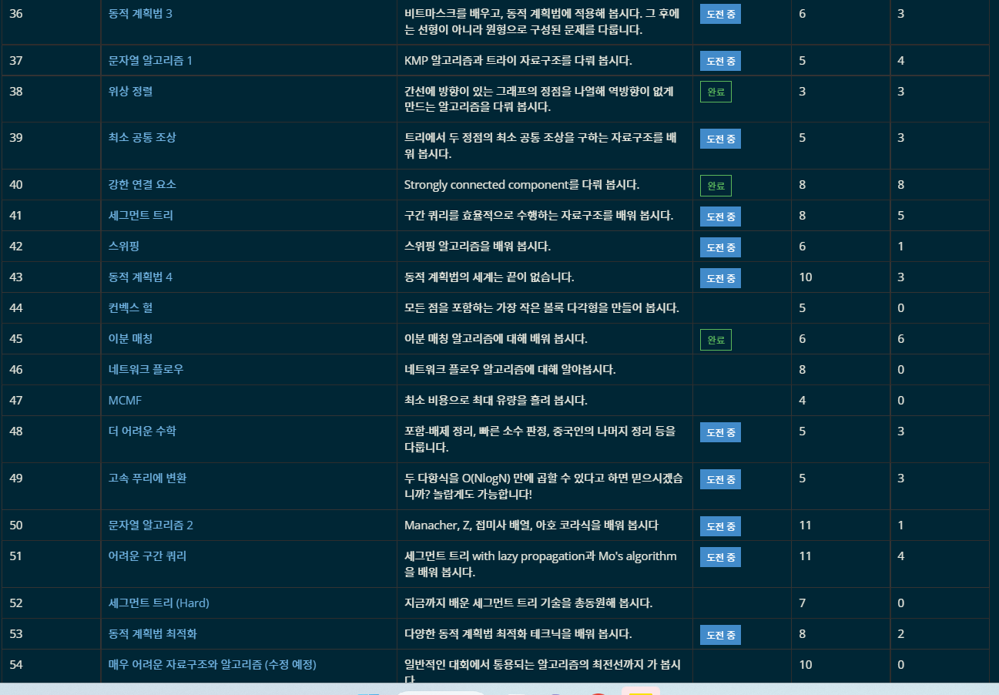

# 1118

TIL이라고 부르기 부끄러운, 오늘만이 아닌 1주간의 내용이다.

1주일 동안 알고리즘 말고 다른 내용의 공부를 좀 했다. golang은 꾸준히 보는 중. 주말 중에 알고리즘 한 두 문제 풀어보는 것도?

코드몬스터는 무난하게 예선 통과했다. 본선을 마곡에서 오프라인으로 한다는데, 몹시 몹시 매우 매우 가기 귀찮다. 상품만 받을 수 없나 ㅎ...


## Label Studio 작업 페이지 만들기

장고로 서버가 구현되어 있는 label studio를 여려 명이서 쓸 일이 생겼다. 호스트의 로컬 DB에 모든 작업 데이터가 저장되는? 그런 플랫폼인 거 같다. 익숙한 Heroku로 새 페이지를 파서 배포할까 했는데, 아무래도 데이터를 Heroku 자체 DB에 올리는 게 마음에 걸렸다.

그래서 gcp를 이용해 페이지를 띄우기로 했다. 이제 월화수 3일 간 한 뻘짓들을 정리해보려 한다.

1. 당장 테스트용으로 로컬에 라벨스튜디오 페이지를 띄우는 것부터 애를 먹었다. 파이썬과 pip의 버전이 맞지 않아 생겼던 문제였다.
2. gcp 자체가 뭐하는 건지 몰라서 사이트와 용어들이랑 친해지는 데 좀 시간을 썼다.
3. 처음에는 도커 이미지를 따서 VM 상에 배포하려 했다. VM 인스턴스를 만들 때 컨테이너 선택이 가능해서 이 쪽이 편할 줄 알았는데, 훨씬 불편한 쪽이었다.
4. 네트워크를 발급받고 나서, 방화벽 설정 때문에 애를 먹었다. 처음에는 모든 HTTP, HTTPS 요청을 허락하고 0.0.0.0 IP를 허락하도록 해놨다. 그래서 VM 인스턴스를 쉽게 발급받을 수 있을 줄 알았는데, 계속 연결이 잘 안 됐다. 이걸 해결하기 위해서 (내가 설정할 수 있는) 모든 방화벽 설정을 해제하고 VM 인스턴스와 연결했다.
5. 연결하고 나면 끝인 줄 알았는데, 이젠 네트워크 접속이 안 됐다. 그래서 방화벽을 다시 키면서, VM이 쓸 IP를 특정해줬더니 해결됐다. 처음에 안 됐던 이유가 보안 이슈인가 싶긴 한데... 아직 정확한 이유는 모르겠다.
6. VM의 SSH 터미널에서 라벨 스튜디오를 실행했을 때, 터미널 창을 끄면 (당연하지만) 라벨 스튜디오에 접속할 수 없었다. 그래서 `nohup`과 `&`를 이용해 백그라운드에서 실행되도록 했다.

헤매긴 했지만, 더 나은 내일이 되면 된다. 다음엔 더 잘할 수 있지 싶다.

도커 등 개발 인프라 쪽 내용을 글로 읽을 땐 '이게 뭔 소리야' 싶었는데, 직접 부딪혀 보니까 이해가 된다. 아직 쿠버네티스 친구는 좀 낯설긴 하지만... 

우여곡절 끝에 페이지를 띄우고, 라벨 스튜디오 페이지를 꾸미는 건 공식 문서가 잘 되어 있어서 금방 했다.


## 백준 단계별로 풀어보기

갑자기 백준 단계별로 풀어보기에 남은 문제를 밀어버리고 싶어졌다. 정말 아무 이유없이... 덕분에 실버 ~ 플레 문제들을 20문제 가량 풀었다. 기록 남길만한 건 세그먼트 트리가 무난하게 잘 풀렸다는 정도? 평생 세그트리랑 안 친해질 줄 알았는데 ㅋㅋ 암튼 챕터35 기하2까지는 다 밀었다. 



이제 정말 플로우를 해야할 거 같다. 플로우랑 친해질 수 있겠지?


## K-Inversions - [백준 13055](https://www.acmicpc.net/problem/13055)

> FFT (NTT)

여느 때처럼 랜덤다5 돌렸는데, 문제 읽자마자 FTT 생각이 나서 바로 구현해서 AC. 핵심은 A의 위치를 뒤에서 떨어진 거리로, B의 위치는 앞에서 떨어진 거리로 기록을 해놓으면 된다.

별로 특별한 건 없지만 기록을 하는 이유는, [`hjroh0315`](https://www.acmicpc.net/user/hjroh0315) 님의 풀이에서 재미난 걸 찾았다.

```Python
# hjroh0315 님의 다항식 곱셈 함수
# https://www.acmicpc.net/source/46656183
import sys,decimal
def multiply(a: list[int], b: list[int], digit: int = 0) -> list[int]:
    """Returns the multiplication of two polynomials."""
    decimal.setcontext(
        decimal.Context(prec=decimal.MAX_PREC, Emax=decimal.MAX_EMAX))
    if digit == 0:
        digit = min(20, len(str(min(len(a), len(b)) * max(a) * max(b))))
    f = f'0{digit}d'
    a_dec = decimal.Decimal(''.join(format(x, f) for x in a))
    b_dec = decimal.Decimal(''.join(format(x, f) for x in b))
    c_dec = a_dec * b_dec
    total_digit = digit * (len(a) + len(b) - 1)
    c = format(c_dec, f'0{total_digit}f')
    return [int(c[i:i + digit]) for i in range(0, total_digit, digit)]
```

a와 b 리스트 구현 과정은 완전히 나랑 같다. 근데 `decimal` 라이브러리 활용한 재밌는 풀이였다. 
