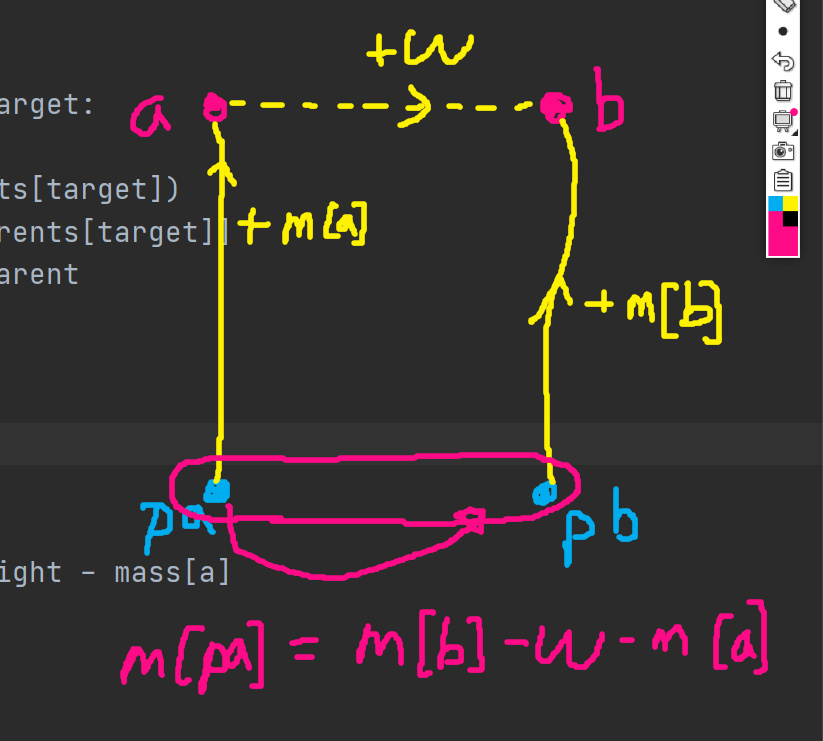

# 0321


## Parcel - [백준 16287](https://www.acmicpc.net/problem/16287)

이걸 뭐로 분류해야 하는가... 그나마 투포인터인가??

```python
from collections import defaultdict
from sys import stdin

input = stdin.readline


def sol(array, l, t):
    dp = defaultdict(bool)
    for i in range(l - 1):
        for j in range(i + 1, l):
            if dp[t - array[i] - array[j]]:
                return 'YES'
        for k in range(i):
            dp[array[i] + array[k]] = True
    return 'NO'


target, m = map(int, input().split())
nums = list(map(int, input().split()))
print(sol(nums, m, target))
```

뭔가 참... 카테고리를 분류하기 애매하다. 처음에는 전체 가능한 두 수의 합을 구하고 정렬한 뒤 투 포인터로 코드를 짜 O(n<sup>2</sup> log n)으로 풀었는데, 시간 초과가 떴다. 그래서 O(n<sup>2</sup>) 풀이를 찾아보려 노력했다. 두 수의 합을 갱신하여 답을 찾는 O(n<sup>2</sup>) 풀이는 쉽게 떠올랐지만, 문제는 답을 구했을 때 4개의 수가 중복되는 것이 있는 경우였다. 즉, **두 수의 합을 갱신하는 순서를 일반적인 방법과 다르게 할 필요가 있었다.** 여러 방법을 생각해보다가...

1. 현재 탐색 위치와 그 뒤에 있는 수의 합 `x`들을 구해 `target - x`가 `dp`에 있는지 확인한다.
2. 현재 탐색 위치와 그 앞에 있는 수의 합들을 `dp`에 추가한다.
3. 탐색 위치를 1 증가시킨다.

달리 말하면, 현재 탐색 위치와 앞에서 2개, 뒤에서 1개를 뽑아 합을 `target`과 비교하는 것이다. 답이 존재한다면 해당 탐색에서 답이 항상 나올테니까. 이렇게 보니 DP 느낌도 나는 것 같고... 암튼 갱신 순서를 상당히 재밌게 찾아냈다. 이런 문제 더 없나? 


## 교수님은 기다리지 않는다 - [백준 3830](https://www.acmicpc.net/problem/3830)

분리 집합

```python
from sys import stdin, setrecursionlimit

input = stdin.readline
setrecursionlimit(10 ** 5)


def find(target):
    if parents[target] == target:
        return target
    new_parent = find(parents[target])
    mass[target] += mass[parents[target]]
    parents[target] = new_parent
    return parents[target]


def union(a, b, weight):
    pa = find(a)
    pb = find(b)
    mass[pa] = mass[b] - weight - mass[a]
    parents[pa] = pb


while True:
    n, m = map(int, input().split())
    if n == m == 0:
        break
    parents = list(range(n + 1))
    mass = [0] * (n + 1)
    for _ in range(m):
        order, *nums = input().strip().split()
        nums = [int(num) for num in nums]
        if order == '!':
            x, y, w = nums
            if find(x) != find(y):
                union(x, y, w)
        else:
            x, y = nums
            if find(x) != find(y):
                print('UNKNOWN')
            else:
                print(mass[y] - mass[x])
```

대답할 수 있는 지 여부는 금방 알 수 있다. 단순한 분리 집합으로 구하면 되니까. 하지만 이 문제가 플레인 이유가 있다. 대답할 수 있을 때 뭐라고 대답할 건지를 찾아야 한다. 우리가 알아야 할 정보는 정확한 무게가 아닌, 두 물건의 무게 차이이다. 즉, `mass`에는 물건이 자신의 parents에 대해 얼마나 차이나는 지만 저장하면 된다. 그리고 세그먼트 트리에서 게으르게 갱신하는 알고리즘처럼, 비슷하게 갱신해주면 된다.



`pa`를 `pb`와 합친다? 라는 표현은 적절치 않지만, 암튼 둘이 합칠건데, `pb`가 최종 parents가 되게 할 예정이라면, **pa 위의 모든 점을 다 갱신해주는 게 아니라 pa만 갱신해주는 것이 포인트.** 차피 원래 `pa` 위의 점 `x`는 `find`함수에 들어갔을 때  `x`, `pa`, `pb`순으로 재귀 함수가 작동하니까, `union`은 `pa`의 `mass`만 갱신해줘도 되는 것이다!

`defaultdict`의 편함에 취해 `mass`함수 까지도 억지로 `defaultdict(int)`쓰고 있는 걸 눈치차려 graph 그릴 때 말고는 봉인하기로 했다. 연산 시간도 더 걸리는 거 같고, 인덱스 조작을 해야 실력이 더 늘지


## 2 SAT no.4 - [백준 11281](https://www.acmicpc.net/problem/11281)

코사라주, 2-SAT

```python
from sys import stdin, setrecursionlimit
from collections import defaultdict

input = stdin.readline
setrecursionlimit(10 ** 5)


def dfs(idx):
    if visited[idx]:
        return
    visited[idx] = True
    for adj in graph[idx]:
        if not visited[adj]:
            dfs(adj)
    stack.append(idx)


def dfs_inv(idx):
    if scc[idx]:
        return
    scc[idx] = component
    for adj in graph_inv[idx]:
        if not scc[adj]:
            dfs_inv(adj)


def sol(array):
    nn = len(array) // 2
    result = []
    for ii in range(1, nn + 1):
        if array[ii] == array[-ii]:
            return 0
        if array[ii] < array[-ii]:
            result.append(0)
        else:
            result.append(1)
    return result


n, m = map(int, input().split())
graph = defaultdict(list)
graph_inv = defaultdict(list)
for _ in range(m):
    x, y = map(int, input().split())
    graph[-x].append(y)
    graph[-y].append(x)
    graph_inv[x].append(-y)
    graph_inv[y].append(-x)
stack = []
visited = [False] * (2 * n + 1)
for i in range(1, n + 1):
    if not visited[i]:
        dfs(i)
    if not visited[-i]:
        dfs(-i)
scc = [0] * (2 * n + 1)
component = 0
while stack:
    now = stack.pop()
    if not scc[now]:
        component += 1
        dfs_inv(now)
ans = sol(scc)
if ans:
    print(1)
    print(*ans)
else:
    print(0)
```

코사라주 알고리즘 한정이지만, SCC는 이제 눈 감고도 할 정도가 됐다. 이미 2-SAT 문제를 풀어봐서 판별하기는 쉬웠다. 대신 이전 [2-SAT 3](https://www.acmicpc.net/problem/11280) 문제와 다르게 판별을 다른 로직으로 했다. 추잡스럽게 `flag`변수를 조작하는 것이 아닌, 그냥 `scc` 리스트를 싹 구한 뒤 `+x`와 `-x`가 같은 component에 있는지 찾아줬다.

문제는 역추적이었다. [ATM](https://www.acmicpc.net/problem/4013) 문제를 기억하고 있다면, 어떻게 할지 떠올릴 수 있다. 기억 안 나면 3월 19일 TIL 다시 읽으시고... 암튼 그 때 알아낸 사실은,

> SCC 간의 graph의 하위 SCC부터 dfs_inv 탐색을 한다. 

또한, 아래와 같은 사실도 알고 있다.

> `~p` &#8594;  `q` 는,  `p`가 참이면 항상 참이다. 

그렇다는 것은, 상위 component 애들, 즉 component 인덱스가 큰 쪽을 참으로 설정해주면 2 SAT 의 한 가지 해가 나오게 된다! 그래서 `scc` 리스트를 가지고 해를 찾는 함수 `sol`을 구현했다.

```python
def sol(array):
    nn = len(array) // 2
    result = []
    for ii in range(1, nn + 1):
        if array[ii] == array[-ii]:
            return 0
        if array[ii] < array[-ii]:
            result.append(0)
        else:
            result.append(1)
    return result
```

SCC 문제가 새로운 점수 올리기 효자 종목이 되어가고 있다 ㅎ


## TV Show Game - [백준 16367](https://www.acmicpc.net/problem/16367)

코사라주, 2-SAT

```python
from collections import defaultdict
from sys import stdin, setrecursionlimit

input = stdin.readline
setrecursionlimit(10 ** 5)


def dfs(idx):
    if visited[idx]:
        return
    visited[idx] = True
    for adj in graph[idx]:
        if not visited[adj]:
            dfs(adj)
    stack.append(idx)


def dfs_inv(idx):
    if scc[idx]:
        return
    scc[idx] = component
    for adj in graph_inv[idx]:
        if not scc[adj]:
            dfs_inv(adj)


def sol(array):
    nn = len(array) // 2
    result = ''
    for ii in range(1, nn + 1):
        if array[ii] == array[-ii]:
            return -1
        if array[ii] < array[-ii]:
            result += 'B'
        else:
            result += 'R'
    return result


n, m = map(int, input().split())
graph = defaultdict(list)
graph_inv = defaultdict(list)
for _ in range(m):
    a = list(input().strip().split())
    order = [0, 0, 0]
    for i in range(3):
        if a[2 * i + 1] == 'R':
            order[i] = int(a[2 * i])
        else:
            order[i] = -int(a[2 * i])
    for i in range(3):
        for j in range(3):
            if i != j:
                graph[-order[i]].append(order[j])
                graph[-order[j]].append(order[i])
                graph_inv[order[i]].append(-order[j])
                graph_inv[order[j]].append(-order[i])
visited = [False] * (2 * n + 1)
stack = []
for i in range(1, n + 1):
    if not visited[i]:
        dfs(i)
    if not visited[-i]:
        dfs(-i)
scc = [0] * (2 * n + 1)
component = 0
while stack:
    now = stack.pop()
    if not scc[now]:
        component += 1
        dfs_inv(now)
print(sol(scc))
```

논리식을 그려놓고 10분 정도 고민했다. 3개 중 최소 2개를 성립하게 하려면 어떻게 해야하는가 생각해보니, 2 SAT 문제와 굉장히 비슷하게 진행하면 되는 것이었다. `p`, `q`, `r`에 대해서 `~p` &#8594;  `q` 같이 가능한 쌍 6개를 만들어주면 된다. `p`와 `q` 중 적어도 하나, `q`와 `r` 중 적어도 하나, `r`와 `p` 중 적어도 하나가 참이라는 말은, `p`, `q`, `r` 중 적어도 2개는 참이라는 말과 동치이다! 이후는 2 SAT 문제로 해결만 해주면 끝.
