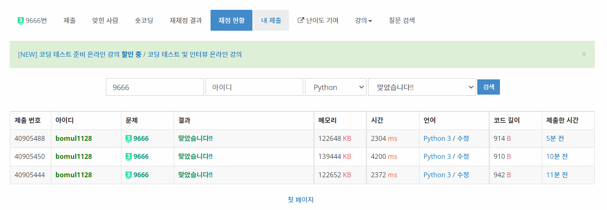

# 0323


## Book Club - [백준 10532](https://www.acmicpc.net/problem/10532)

이분 매칭

```python
from sys import stdin, setrecursionlimit

setrecursionlimit(5 * 10 ** 4)
input = stdin.readline


def dfs(idx):
    for adj in graph[idx]:
        if visited[adj]:
            continue
        visited[adj] = True
        if match[adj] == -1 or dfs(match[adj]):
            match[adj] = idx
            return True
    return False


n, m = map(int, input().split())
graph = [[] for _ in range(n)]
for _ in range(m):
    x, y = map(int, input().split())
    graph[x].append(y)
match = [-1] * n
ans = 0
ans = 'YES'
for i in range(n):
    visited = [False] * n
    if not dfs(i):
        ans = 'NO'
        break
print(ans)
```

오늘 한 문제도 못 풀 뻔했는데 간신히 이분 매칭 한 문제 찾아 해결했다. 휴


## :heavy_exclamation_mark:(TLE) SUMO - [백준 9666](https://www.acmicpc.net/problem/9666)

이분 매칭

```python
from sys import stdin, setrecursionlimit

setrecursionlimit(5 * 10 ** 4)
input = stdin.readline


def dfs(idx):
    global flag
    if visited[idx]:
        flag = True
        return
    visited[idx] = True
    team[idx] = 3 - team[idx]
    for adj in graph[idx]:
        if team[idx] == team[adj]:
            dfs(adj)


n = int(input())
graph = [[] for _ in range(n + 1)]
team = [0] * (n + 1)
for i in range(1, int(input()) + 1):
    x, y = map(int, input().split())
    graph[x].append(y)
    graph[y].append(x)
    if team[x] == team[y] == 0:
        team[x] = 1
        team[y] = 2
    elif team[x] == team[y]:
        flag = False
        visited = [False] * (n + 1)
        dfs(y)
        if flag:
            print(i)
            exit()
    else:
        if team[x]:
            team[y] = 3 - team[x]
        else:
            team[x] = 3 - team[y]
```

n이 10만, m이 30만 스케일이여서, 지금 풀이는 O(nm)이므로 시간 초과가 뜰 만하다.

쿼리를 처리해주면서 바로바로 확인해주고 팀을 갱신해줬는데, 별로 좋지 않았나보다.


## SUMO - [백준 9666](https://www.acmicpc.net/problem/9666)

이진 탐색, 약간의 이분 매칭?

```python
from sys import stdin, setrecursionlimit

setrecursionlimit(10 ** 5)
input = stdin.readline


def dfs(v_idx, t_idx):
    global flag
    if not flag:
        return
    if team[v_idx]:
        if team[v_idx] != t_idx:
            flag = False
        return
    else:
        team[v_idx] = t_idx
    for adj, value in graph[v_idx].items():
        if value <= limit:
            dfs(adj, -t_idx)


def check():
    for idx in range(1, n + 1):
        if not team[idx]:
            dfs(idx, 1)


n = int(input())
graph = [{} for _ in range(n + 1)]
team = [0] * (n + 1)
m = int(input())
for i in range(1, m + 1):
    x, y = map(int, input().split())
    graph[x][y] = i
    graph[y][x] = i
start = 1
end = m
while start <= end:
    limit = (start + end) // 2
    team = [0] * (n + 1)
    flag = True
    check()
    if flag:
        start = limit + 1
    else:
        ans = limit
        end = limit - 1
print(ans)
```

딴 거 풀려다 바로 이 풀이가 생각나 풀었다. O(nm)이 아니라면 O(n log m)일 확률이 높으니까... 라고 생각하다보니 나온 풀이다. 그래프 간선에 번호를 부여하고, 그 값이 `limit`보다 작거나 같은 값에 대해서만 탐색을 진행해 이분 그래프가 아니면 글로벌 변수 `flag`가 False가 되도록 코드를 짰다. 처음엔 `TLE`가 떴었는데, 그 때의 `dfs`함수는 아래와 같았다.

```python
def dfs(v_idx, t_idx):
    global flag
    if team[v_idx]:
        if team[v_idx] != t_idx:
            flag = False
            return
        return
    else:
        team[v_idx] = t_idx
    for adj, value in graph[v_idx].items():
        if value <= limit:
            dfs(adj, -t_idx)
```

즉, 정답 코드의 `if not flag`라는 부분이 탐색을 많이 줄여주었다. `m`이 너무 크면, 초반에 탐색을 진행할 때 `flag`변수가 비교적 빠르게 False가 되는 상황이 있을 수도 있겠다라는 생각이 들었다.



덕분에 유일하게 python으로 푼 사람이 되었다 ㅅㅅㅅ


## :heavy_exclamation_mark:(TLE) 쌍둥이 마을 - [백준 1098](https://www.acmicpc.net/problem/1098)

완전 탐색?

```python
from sys import stdin

input = stdin.readline


def dist(p1, p2):
    return abs(p1[0] - p2[0]) + abs(p1[1] - p2[1])


def sol(pair, cost, pointer, degree):
    global ans_pair, ans_cost
    if pair + (m - pointer) < ans_pair:
        return
    if pair + (m - pointer) == ans_pair and ans_cost <= cost:
        return
    if pointer == m:
        if pair > ans_pair:
            ans_pair = pair
            ans_cost = cost
        elif pair == ans_pair and ans_cost > cost:
            ans_cost = cost
        return
    z, x, y = graph[pointer]
    if 3 & (degree >> x) < p and 3 & (degree >> y) < p:
        sol(pair + 1, cost + z, pointer + 1, degree + (1 << x) + (1 << y))
    sol(pair, cost, pointer + 1, degree)


n = int(input())
town = [tuple(map(int, input().split())) for _ in range(n)]
p, d = map(int, input().split())
graph = []
for i in range(n - 1):
    for j in range(i + 1, n):
        if dist(town[i], town[j]) >= d:
            graph.append((dist(town[i], town[j]), 2 * i, 2 * j))
graph.sort()
m = len(graph)
ans_pair = 0
ans_cost = 0
sol(0, 0, 0, 0)
print(ans_pair, ans_cost)
```

답은 나온다. 나오긴 하는데... 내가 만든 n = 10 완전 그래프를 돌리니 끝날 기미가 안 보였다. 개선 방법은 차근차근 생각해보자... 벌써 새벽 6시다. 오늘은 늦었으니 그만 자는 걸로.