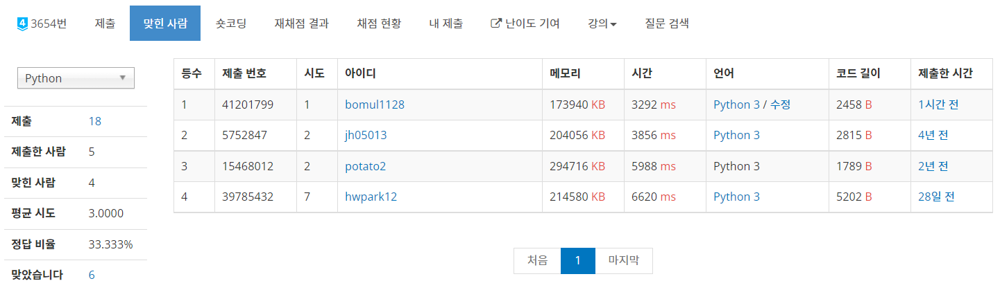

# 0330


## :diamond_shape_with_a_dot_inside: L퍼즐 - [백준 3654](https://www.acmicpc.net/problem/3654)

2 SAT, 코사라주

```python
from sys import stdin, setrecursionlimit
from collections import defaultdict

input = stdin.readline
setrecursionlimit(10 ** 6)


def new_idx(idx, direction):
    if direction <= 1:
        return 2 * idx - direction
    return - 2 * idx + (direction - 2)


def draw_edge(nums):
    l = len(nums)
    for a in range(l - 1):
        for b in range(a + 1, l):
            graph[nums[a]].append(-nums[b])
            graph[nums[b]].append(-nums[a])
    return True


def dfs(idx):
    if visited[idx]:
        return
    visited[idx] = True
    for adj in graph[idx]:
        if not visited[adj]:
            dfs(adj)
    stack.append(idx)


def dfs_inv(idx):
    global flag2
    if scc[idx]:
        return
    scc[idx] = component
    if scc[idx] == scc[-idx]:
        flag2 = False
        return
    for adj in graph[-idx]:
        if not scc[-adj]:
            dfs_inv(-adj)


dx = [-1, 0, 1, 0]
dy = [0, -1, 0, 1]
for _ in range(int(input())):
    n, m = map(int, input().split())
    board = [list(input().rstrip()) for _ in range(n)]
    bn = 0
    wn = 0
    nw = []
    flag = True
    white = defaultdict(list)
    for i in range(n):
        for j in range(m):
            if board[i][j] == 'B':
                bn += 1
                board[i][j] = bn
                cnt = 0
                for d in range(4):
                    ni = i + dx[d]
                    nj = j + dy[d]
                    nn = new_idx(board[i][j], d)
                    if 0 <= ni < n and 0 <= nj < m and board[ni][nj] == 'W':
                        cnt += 1
                        white[(ni, nj)].append(nn)
                    else:
                        nw.append(nn)
                if cnt < 2:
                    flag = False
            elif board[i][j] == 'W':
                wn += 1
    if bn * 2 != wn or not flag:
        print('NO')
        continue
    graph = [[] for _ in range(4 * bn + 1)]
    for k in nw:
        graph[k].append(-k)
    for value in white.values():
        draw_edge(value)
    del white
    stack = []
    visited = [False] * (4 * bn + 1)
    for i in range(1, 2 * bn + 1):
        if not visited[i]:
            dfs(i)
        if not visited[-i]:
            dfs(-i)
    scc = [0] * (4 * bn + 1)
    component = 0
    flag2 = True
    while stack and flag2:
        now = stack.pop()
        if not scc[now]:
            component += 1
            dfs_inv(now)
    if flag2:
        print('YES')
    else:
        print('NO')
```

6일 고민 끝에 다이아 문제 해결 ㅅㅅㅅㅅㅅ

처음엔 이분 매칭으로 접근했었다. 왼쪽과 오른쪽, 위쪽과 아래쪽 하얀색이 공존할 수 없는 것이 이분 그래프랑 닮아보였으니까. 근데 범위가 너무 크기도 하고, 도저히 코드로 구현할 수가 없었다. 그러다가 2 SAT 논리 구조가 생각났다. 이 문제 또한 ~이면 ~이다 형태로 나타낼 수 있으니까, 2 SAT로 해결할 수 있을 것 같았다. 풀이 방향을 잡고 나니 코드는 비교적 수월하게 나오기 시작했다. 생각한 포인트는,

- 하얀색 개수 `wn`과 검정색 개수 `bn`은 `bn * 2 = wn`을 만족해야 한다.
- 각 검정색 옆에는 적어도 하얀색이 2개 존재한다. `cnt`는 검정 근처의 하얀색 개수를 의미한다.
- 검정색은 위와 아래에서 반드시 하나의 하얀색을 선택한다. 좌우도 마찬가지.
- 하얀색은 상하좌우 중 반드시 하나의 검정색을 선택한다.

여기서 선택의 의미는, 같은 타일에 속한다는 뜻이다. 이제 2 SAT로 쓱 풀어주자! ... 가 아니드라. 고민할 포인트가 남아있었다. 그래서 논리식으로 어떻게 표현해 줄건데?? 문제점은 크게 2가지가 있었다.

1. 검정색이 선택할 수 없는 칸(인접 칸이 하얀색이 아닌 경우 or 보드판의 경계선인 경우) 처리를 어떻게 해줄 것인가?
2. 애초에 논리식을 어떻게 표현할 것인가?

이를 위해 검정색에 넘버링을 부여해주었다. 그 다음 **`n`번째 검정색에 대해, `2n`은 위, `2n-1`은 왼쪽, `-2n`은 아래, `-2n+1`은 오른쪽으로 생각해줬다**. 왼쪽이 아니라면 오른쪽이어야 하므로, 좌우와 상하는 서로 간에 플마 관계를 가지게 해줬다. 이제는 정말로 2 SAT랑 굉장히 비슷해졌다! 마지막으로 예외 처리를 해주면 된다. 검정색이 선택 못하는 쪽을 `nw` (no white의 줄임말이다 ㅎ)에 저장해주었다. 그 다음 거짓일 때만 성립하는 명제 `p`&#8594;`~p`를 그래프에 추가했다. 또한, 이번 문제에서 저번에 메모리 초과 해결하기 위해 노력한(끝내 못 해결한) [문제](https://www.acmicpc.net/problem/2416)에서 생각한, 역방향 그래프를 따로 만들지 않고 코사라주 돌리기를 시도해보았다. 그 결과...



크으 메모리 사용량도 젤 적고, 시간도 젤 빠른 코드가 나왔다. 오예~~


## :diamond_shape_with_a_dot_inside: Ax + Bsin(x) = C No.2 - [백준 14786](https://www.acmicpc.net/problem/14786)

수학? 작은 수 정밀 연산?

```python
"""
파이썬 공식 문서
https://python.flowdas.com/library/decimal.html#recipes
"""
from math import sin
from decimal import *

getcontext().prec = 50
pi = Decimal('3.1415926535897932384626433832795028841971693993751058209749445923')


def sin(x):
    x = x % (2 * pi)
    getcontext().prec += 2
    i, lasts, s, fact, num, sign = 1, 0, x, 1, x, 1
    while s != lasts:
        lasts = s
        i += 2
        fact *= i * (i-1)
        num *= x * x
        sign *= -1
        s += num / fact * sign
    getcontext().prec -= 2
    return +s


def f(x):
    return a * x + b * sin(x) - c


a, b, c = map(Decimal, input().split())
left = (c - b) / a
right = (c + b) / a
while (right - left) > Decimal(1e-40):
    middle = (left + right) / 2
    if f(middle) < 0:
        left = middle
    else:
        right = middle
print(round(middle, 6))
```

이런 문제가 있네 ㅋㅋ 수치해석 강의를 많이 들어보았기 때문에 해를 찾는 건 어렵지 않았다. 일단 함수 f(x)를 아래와 같이 설정했다.
$$
f(x) = Ax + B \sin{x} - C \\
f'(x) = A + B \cos{x} \ge A - B \ge 0
$$
f(x)는 증가함수라는 사실을 알 수 있다. 처음엔 뉴턴법? 이었나로 해결했다.

```python
import math


def f(x):
    return a * x + b * math.sin(x) - c


def df(x):
    return a + b * math.cos(x)


a, b, c = map(int, input().split())
t = c / a
for _ in range(100):
    t = (df(t) * t - f(t)) / df(t)
print('{:.6f}'.format(t))
```

그러나 WA. 그래서 증가함수라는 점을 이용해 이분법으로 풀이를 바꿔봤다.

```python
import math


def f(x):
    return a * x + b * math.sin(x) - c


a, b, c = map(int, input().split())
left = (c - b) / a
right = (c + b) / a
for _ in range(10 ** 6):
    middle = (left + right) / 2
    if f(middle) < 0:
        left = middle
    else:
        right = middle
print('{:.6f}'.format(middle))
```

초기 구간 설정은 삼각함수 값의 범위를 생각하면 금방 나온다. 하지만 이것 역시 WA였다. 게시판 글을 보니, `decimal` 라이브러리를 활용해 작은 수 정밀 연산이 필요하다고 한다. 그래서 decimal 라이브러리 [공식 문서](https://python.flowdas.com/library/decimal.html)를 참고해서 코드를 바꿨다.

```python
from math import sin
from decimal import *

getcontext().prec = 50


def sin(x):
    getcontext().prec += 2
    i, lasts, s, fact, num, sign = 1, 0, x, 1, x, 1
    while s != lasts:
        lasts = s
        i += 2
        fact *= i * (i-1)
        num *= x * x
        sign *= -1
        s += num / fact * sign
    getcontext().prec -= 2
    return +s


def f(x):
    return a * x + b * sin(x) - c


a, b, c = map(int, input().split())
left = (c - b) / a
right = (c + b) / a
while (right - left) > Decimal(1e-13):
    middle = (left + right) / 2
    if f(middle) < 0:
        left = middle
    else:
        right = middle
print(round(middle, 6))
```

`sin(x)`의 식이 이제 테일러 급수로 계산을 한다. `while (right - left) > Decimal(1e-13):`부분에서 정확도를 높이고 싶었지만, 너무 시간이 오래 걸려 할 수 없었다. 결국 또다시 WA. 그래서 정확도를 늘릴려면 어떻게 해야하나 고민하다가... 테일러 급수의 시간을 줄일 필요가 있다는 생각이 들었다. 사인 함수는 주기 함수인 점을 이용해서 계산을 줄여주는 것이다!

```python
pi = Decimal('3.1415926535897932384626433832795028841971693993751058209749445923')


def sin(x):
    x = x % (2 * pi)
    ...
```

그래서 해당 부분을 추가해주고, `while (right - left) > Decimal(1e-40):`으로 수정해 정확도를 확 늘려줬더니 AC를 받았다. `decimal`라이브러리가 아직 그렇게 친숙하진 않다. 좀더 많이 활용해봐야겠다.


## 초등 수학 - [백준 11670](https://www.acmicpc.net/problem/11670)

이분 매칭

```python
from sys import stdin, setrecursionlimit
from collections import defaultdict

input = stdin.readline
setrecursionlimit(10 ** 4)


def dfs(idx):
    for adj in graph[idx]:
        if visited[adj]:
            continue
        visited[adj] = True
        if match[adj] == 0 or dfs(match[adj]):
            match[adj] = idx
            return 1
    return 0


n = int(input())
graph = [[] for _ in range(n + 1)]
result = [{} for _ in range(n + 1)]
ans = [[0] * 5 for _ in range(n + 1)]
for t in range(1, n + 1):
    a, b = map(int, input().split())
    ans[t][0] = a
    ans[t][2] = b
    ans[t][3] = '='
    graph[t] = [a + b, a - b, a * b]
    result[t] = {a + b: '+', a - b: '-', a * b: '*'}
match = defaultdict(int)
flag = True
for i in range(1, n + 1):
    visited = defaultdict(bool)
    if not dfs(i):
        flag = False
        break
if flag:
    for key, value in match.items():
        ans[value][4] = key
        ans[value][1] = result[value][key]
    for i in range(1, n + 1):
        print(*ans[i])
else:
    print('impossible')
```

`defaultdict` 라이브러리를 활용하면 쉽게 해결할 수 있는 문제였다. 계산 결과의 범위만큼의 `visited`와 `match`를 만들기는 힘들기 때문에, `defaultdict`으로 기본값 설정을 해주었다. 전형적인 이분 매칭 문제.


## 룩 배치하기 - [백준 9525](https://www.acmicpc.net/problem/9525)

이분 매칭

```python
from sys import stdin

input = stdin.readline


def dfs(idx):
    for adj in graph[idx]:
        if visited[adj]:
            continue
        visited[adj] = True
        if not match[adj] or dfs(match[adj]):
            match[adj] = idx
            return 1
    return 0


n = int(input())
board = [list(input().strip()) for _ in range(n)]
row = [[0] * n for _ in range(n)]
col = [[0] * n for _ in range(n)]
rn, cn = 0, 0
for i in range(n):
    for j in range(n):
        if board[i][j] == '.':
            if not row[i][j]:
                rn += 1
                ii, jj = i, j
                while ii < n and jj < n and board[ii][jj] == '.':
                    row[ii][jj] = rn
                    jj += 1
            if not col[i][j]:
                cn += 1
                ii, jj = i, j
                while ii < n and jj < n and board[ii][jj] == '.':
                    col[ii][jj] = cn
                    ii += 1
graph = [[] for _ in range(rn + 1)]
for i in range(n):
    for j in range(n):
        if board[i][j] == '.':
            graph[row[i][j]].append(col[i][j])
match = [0] * (cn + 1)
ans = 0
for i in range(1, rn + 1):
    visited = [False] * (cn + 1)
    ans += dfs(i)
print(ans)
```

[게시판 구멍 막기](https://www.acmicpc.net/problem/2414)랑 비슷한 문제. 행 / 열 방향 각각 넘버링 해주고 그래프 그려준 다음, 이분 매칭해서 최대 매칭의 개수가 답이다.


## 틀렸습니다 - [백준 5398](https://www.acmicpc.net/problem/5398)

이분 매칭

```python
from sys import stdin
from collections import defaultdict

input = stdin.readline


def dfs(idx):
    for adj in graph[idx]:
        if visited[adj]:
            continue
        visited[adj] = True
        if not match[adj] or dfs(match[adj]):
            match[adj] = idx
            return 1
    return 0


for _ in range(int(input())):
    n, m = map(int, input().split())
    board = defaultdict(dict)
    for rn in range(n):
        x, y, word = input().strip().split()
        x, y = int(x), int(y)
        l = len(word)
        for i in range(l):
            board[x + i][y] = (word[i], rn + 1)
    graph = [[] for _ in range(n + 1)]
    for cn in range(m):
        x, y, word = input().strip().split()
        x, y = int(x), int(y)
        l = len(word)
        for i in range(l):
            if y + i in board[x] and board[x][y + i][0] != word[i]:
                graph[board[x][y + i][1]].append(cn)
    ans = n + m
    match = [0] * (m + 1)
    for i in range(1, n + 1):
        visited = [False] * (m + 1)
        ans -= dfs(i)
    print(ans)
```

서로 겹치면서 해당 부분의 글자가 다른 단어끼리 이어 이분 그래프를 만들었다. 그 다음 최소 버텍스 커버의 수를 찾아주면 끝. 문제 조건의 **"가로 단어끼리 위치가 겹치거나 세로 단어끼리 위치가 겹치는 경우는 없다."**라는 말이 있어 한 쪽엔 가로, 다른 한 쪽엔 세로 단어를 배치한 이분 그래프를 그릴 수 있었다. 이 조건이 없었다면 훨씬 어려웠을 듯.
