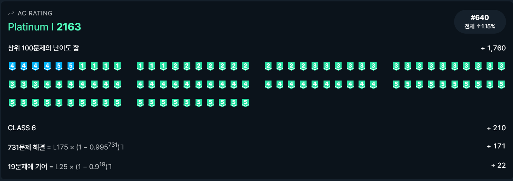

# 0403


## 최소 버텍스 커버 - [백준 2051](https://www.acmicpc.net/problem/2051)

이분 매칭

```python
from sys import stdin, setrecursionlimit

input = stdin.readline
setrecursionlimit(10 ** 4)


def dfs(x):
    for adj in graph[x]:
        if not visited[adj]:
            visited[adj] = True
            if not match[adj] or dfs(match[adj]):
                match[adj] = x
                check[x] = True
                return 1
    return 0


def coloring(idx):
    used_a[idx] = False
    for adj in graph[idx]:
        if match[adj] != idx:
            used_b[adj] = True
            if used_a[match[adj]]:
                coloring(match[adj])


n, m = map(int, input().split())
graph = [[] for _ in range(n + 1)]
for i in range(1, n + 1):
    _, *k = map(int, input().split())
    graph[i] = k
match = [0] * (m + 1)
check = [False] * (n + 1)
ans = 0
for j in range(1, n + 1):
    visited = [False] * (m + 1)
    ans += dfs(j)
print(ans)
used_a = [True] * (n + 1)
used_b = [False] * (m + 1)
for i in range(1, n + 1):
    if not check[i]:
        coloring(i)
a = [i for i in range(1, n + 1) if used_a[i]]
b = [j for j in range(1, m + 1) if used_b[j]]
print(len(a), *a)
print(len(b), *b)
```

헝가리안을 공부하다가, alternating path 개념을 보고, 옛날 수업 시간에 최소 버텍스 커버를 배웠던 게 기억났다. 이게 뭐냐면,

> A와 B에 대한 이분 그래프 G와 간선 E에 대해 최대 매칭의 간선들을 E'라 하자. Alternatin path란, A의 점 중 E에 속하지 않은 점부터 시작해서, E - E' 과 E를 번갈아 가면서 이용해 갈 수 있는 경로이다.

Alternating path에 속한 점들을 X라 했을 때, minimum vertex cover은 아래와 같이 구해진다.
$$
(A - X) \ \cup \ (B \ \cap \ X)
$$
후우... 그래프 이론 전공 수업 때 머리 깨져가면서 배웠던 기억이 다시 떠오른다... 암튼 이 이론에 입각하여 최소 커버를 구할 수 있다. `used_a` 와 `used_b`의 default 값을 각각 `True`와 `False`로 설정해주고 시작하여, 사용하지 않은 점들에서 시작해 `coloring`함수를 구현해줬...

```python
def coloring(idx):
    used_a[idx] = False
    for adj in graph[idx]:
        if match[adj] != idx:
            used_b[adj] = True
            coloring(match[adj])
```

...지만 발생한 `RecursionError`. 재귀 깊이를 늘려줘도 같은 에러가 나는 걸 보니 아무래도 탈출을 못하는 케이스가 있는가 보다.  생각해보니 `match[adj]`에 대해서 이미 `used_a`가 체크, 즉 이미 방문을 했다면 처리할 필요가 없었다. 그래서 조건문을 추가로 달아줬다.

```python
def coloring(idx):
    used_a[idx] = False
    for adj in graph[idx]:
        if match[adj] != idx:
            used_b[adj] = True
            if used_a[match[adj]]:
                coloring(match[adj])
```

결국 AC를 받았다. 이제 남은 건 헝가리안인가...


## 셔틀 버스 - [2018 KAKAO BLINE RECRUITMENT](https://programmers.co.kr/learn/courses/30/lessons/17678)

구현? 시뮬레이션?

```python
def solution(n, t, m, timetable):
    timetable = [trans(time) for time in timetable]
    timetable.sort(reverse=True)
    ans = timetable[-1] - 1
    now = 540
    for _ in range(n):
        bus = []
        full = False
        while timetable and timetable[-1] <= now:
            bus.append(timetable.pop())
            if len(bus) == m:
                ans = bus[-1] - 1
                full = True
                break
        if not full:
            ans = now
        now += t
    return change(ans)


def trans(query):
    h, m = map(int, query.split(':'))
    return h * 60 + m


def change(time):
    hour = str(time // 60)
    minute = str(time % 60)
    if len(hour) < 2:
        hour = '0' * (2 - len(hour)) + hour
    if len(minute) < 2:
        minute = '0' * (2 - len(minute)) + minute
    return f'{hour}:{minute}'
```

한 달 전 쯤? 풀다가 던진 문제다. 스터디 준비하면서 풀었는데, 쉽게 풀렸다. 초기값을 가장 먼저 오는 것으로 설정하고, 각 버스마다 자리가 있을 때마다 타는 시간을 갱신하는 느낌? 충분히 풀 수 있던 걸 왜 안 풀었을꼬...


## 수 - [백준 1056](https://www.acmicpc.net/problem/1056)

다익스트라, 이진 탐색

```python
from sys import stdin
from collections import defaultdict
import heapq

input = stdin.readline


def find(target, sqrt):
    init = 1
    fin = target
    while init <= fin:
        middle = (init + fin) // 2
        if middle ** sqrt >= target:
            ans = middle
            fin = middle - 1
        else:
            init = middle + 1
    return ans


n = int(input())
start = [(0, n), (n - 1, 1)]
dist = defaultdict(int)
dist[1] = n - 1
while start:
    cnt, now = heapq.heappop(start)
    if dist[now] < cnt:
        continue
    if now == 1:
        break
    for div in range(2, 63):
        x = find(now, div)
        cost1 = (now - (x - 1) ** div) + 1
        cost2 = (x ** div - now) + 1
        if cost1 > cost2:
            if dist[x] == 0 or dist[x] > cnt + cost2:
                dist[x] = cnt + cost2
                heapq.heappush(start, (dist[x], x))
        else:
            if dist[x - 1] == 0 or dist[x - 1] > cnt + cost1:
                dist[x - 1] = cnt + cost1
                heapq.heappush(start, (dist[x - 1], x - 1))
    if dist[1] > cnt + now - 1:
        dist[1] = cnt + now - 1
        heapq.heappush(start, (dist[1], 1))
print(cnt)
```

제목이 숨바꼭질이었나? 암튼 이런 1에서 큰 수로 가는 경우엔 역추적을 하는게 더 편하다는 사실을 이미 알고 있다. 이제 n제곱근을 계산해주어야 하는데, 숫자가 크고 n도 꽤 크므로 `int`를 취했을 때 값이 1 정도 차이가 날 수 있다. 그래서 이진 탐색으로 정확한 값을 찾아줬다(정확히는 올림한 값이다). `div`의 범위가 왜 2부터 62냐면, 2<sup>62</sup>가 10<sup>18</sup>근처여서다. 이제 `x`로 갈지 `x - 1`로 갈지 정해야 하는데, 반드시 가까운 쪽으로 가는 게 이득이다. 왜냐하면,  `x ** div`와 `(x - 1) ** div`는 짝수 홀수 관계가 반대이니까, `now`에서 더 가까운 쪽이 존재하고,  `x`와 `x-1` 의 거리가 1이므로 `cost`가 더 작은 쪽으로 간다고 해도 상관없다. 그런 식으로 해서 다익스트라를 돌리면 `n`부터 1까지의 최단 거리가 나오게 된다.

사실 전체 범위에서 랜덤 눌러서 처음으로 나온 문제였다. 나름 플2 문제인데, 바로 풀어버려서 기분이 매우 좋다 ㅎㅎ



이 문제를 풀어서 더 이상 내 점수판에서 골드가 보이지 않기 시작했다. 와하하~~


## 범죄 파티 - [백준 13166](https://www.acmicpc.net/problem/13166)

이분 매칭, 이진 탐색

```python
from sys import stdin, setrecursionlimit
from collections import defaultdict

input = stdin.readline
setrecursionlimit(10 ** 6)


def dfs(idx, limit):
    for adj in graph[idx]:
        if visited[adj] or graph[idx][adj] > limit:
            continue
        visited[adj] = True
        if not match[adj] or dfs(match[adj], limit):
            match[adj] = idx
            return 1
    return 0


n = int(input())
graph = defaultdict(dict)
for i in range(1, n + 1):
    a, ka, b, kb = map(int, input().split())
    graph[i][a] = ka
    graph[i][b] = kb
start = 0
end = 10 ** 6
result = -1
while start <= end:
    middle = (start + end) // 2
    match = defaultdict(int)
    flag = True
    for i in range(1, n + 1):
        visited = defaultdict(bool)
        if not dfs(i, middle):
            flag = False
            break
    if flag:
        result = middle
        end = middle - 1
    else:
        start = middle + 1
print(result)
```

오늘 완전 랜덤 문제 타율이 좋다. 운좋게도 이분 매칭 문제가 나와줬다. 평소의 이분 매칭과 달리, 매칭할 수 있는 간선의 값에 제한을 주어 이분 매칭을 해주었다. 그 제한값을 이진 탐색으로 찾아 출력해 비교적 쉽게 AC.


## 동치 증명 - [백준 3682](https://www.acmicpc.net/problem/3682)

코사라주, 약간의 위상 정렬

```python
from sys import stdin, setrecursionlimit
from collections import defaultdict

input = stdin.readline
setrecursionlimit(10 ** 6)


def dfs(idx):
    if visited[idx]:
        return
    visited[idx] = True
    for adj in graph[idx]:
        if not visited[adj]:
            dfs(adj)
    stack.append(idx)


def dfs_inv(idx):
    if scc[idx]:
        return
    scc[idx] = component
    for adj in graph_inv[idx]:
        if not scc[adj]:
            dfs_inv(adj)
        elif scc[adj] != scc[idx]:
            deg_scc_in[scc[idx]] = 1
            deg_scc_out[scc[adj]] = 1


for _ in range(int(input())):
    n, m = map(int, input().split())
    if n == 1:
        print(0)
        continue
    if m == 0:
        print(n)
        continue
    graph = [[] for _ in range(n + 1)]
    graph_inv = [[] for _ in range(n + 1)]
    for _ in range(m):
        x, y = map(int, input().split())
        graph[x].append(y)
        graph_inv[y].append(x)
    stack = []
    visited = [False] * (n + 1)
    for i in range(1, n + 1):
        if not visited[i]:
            dfs(i)
    del graph
    scc = [0] * (n + 1)
    component = 0
    deg_scc_in = defaultdict(int)
    deg_scc_out = defaultdict(int)
    while stack:
        now = stack.pop()
        if not scc[now]:
            component += 1
            dfs_inv(now)
    del graph_inv
    if component == 1:
        print(0)
    else:
        print(component - min(sum(deg_scc_in.values()), sum(deg_scc_out.values())))
```

Cycle이 존재하면 해당 명제들 간에는 필요충분 관계이므로, SCC의 모든 component들 간에 필요충분 관계를 만들어 주면 되는 문제였다. 근데 이걸 어떻게 구할 것인가... 처음에는 `graph_scc`를 그려서 좀 해보려 했는데, 도무지 아닌 거 같았다. 그래서 위상 정렬과 비슷한 느낌으로 접근해봤다. Root component와 Child component가 존재할 텐데, 이를 최소로 연결해 모두 Cycle 안에 들어오도록 할 전략이 떠올랐다.

1. 아직 방문 안 한 Child component부터 아직 방문 안 한 Root component까지 간선을 그린다. 그리고 둘 다 방문 처리를 해준다.
2. 그 Root component 하위의 방문 안 한 Child component에서 1번 과정을 시작한다. 없으면 3번으로 넘어간다. 해당 과정을 최대로 하도록 1번 과정에서 최선의 선택을 한다.
3. 해당 과정을 모두 거치고 나면, Root나 Child 중 하나의 집합이 남을텐데, 이들은 연결된 요소 아무거나와 역방향 간선을 추가해준다.

**각 Component들 간의 그래프는 여러 개의 Tree로 되어있을테니, 적어도 한 개의 Root와 Child가 있어서, 최선의 선택이 가능하다. 이렇게 해주면 필요한 간선은 총 `max(len(root), len(child))`가 된다!** 카운팅과 중복 처리를 하기 귀찮아 `dfs_inv`에서 간선이 그어질 때 `deg_scc_in`과 `deg_scc_out`을 갱신하여 답을 구하는 형태로 해줬다. 이 방식대로 할 때 주의할 점은, 전체 component의 개수가 1일 때, 즉 모든 명제가 서로 필요충분 관계일 때 예외 처리를 해주어야 한다. 처음에 예외 처리를 안 해줘서 틀렸다 ㅠ


