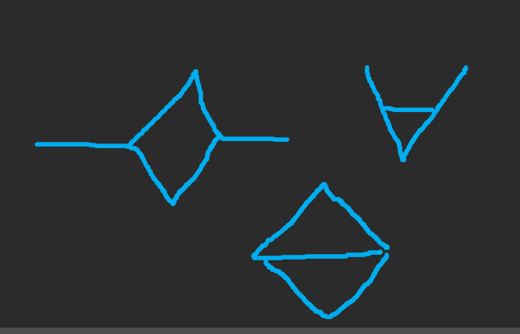

# 0409

뭔가 일정이 많은 하루다.


## Google Code Jam Round 1A

10시부터 시작이었는데... 어제 다이아 풀고 잤더니... 눈 떠보니 10시 30분이었다... 그래서 한 문제 밖에 못 풀었다. 1500등까지 합격이고, 앞으로 2번의 기회 동안 한 번이라도 들면 다음 라운드 진출이라는 듯 하다. 다음 라운드를 노려보자.


## 오늘의 집 코딩테스트

3문제 나왔는데, 앞에 2문제는 평범한 구현 문제였다.

마지막 문제가 좀 골때리게 풀었는데, SCC로 풀었다 ㅋㅋㅋ 분명 더 쉬운 풀이가 있을텐데, 뇌가 굳었는지 그런 풀이 밖에 생각이 안 났다. 코드 붙여놓고 싶지만 안타깝게도 복사 붙여놓기를 사이트에서 막아놓은 것 같드라.


## [Educational Codeforces Round 126 (Rated for Div. 2)](https://codeforces.com/contest/1661)

4 sol ㅅㅅ

5번 문제는 세그 트리 쓰는 문제 같아보여서 바로 스킵.

6번 문제는 텔레포터를 모든 지점에 다 세워놓고 철거하는 식으로 답을 찾아가려다가 시간 없어서 손 뗐다.


## 토끼와 상근 - [백준 9275](https://www.acmicpc.net/problem/9275)

분리 집합

```python
from sys import stdin, setrecursionlimit

input = stdin.readline
setrecursionlimit(10 ** 5)


def find(target):
    if target == parent[target]:
        return target
    parent[target] = find(parent[target])
    return parent[target]


def union(a, b):
    a = find(a)
    b = find(b)
    parent[a] = b


def check(a):
    for b in stack:
        if find(a) == find(b):
            checker = 0
            for aa in graph[a]:
                if aa == b:
                    checker += 1
                if b in graph[aa]:
                    checker += 1
            if checker < 2:
                return True
    return False


while True:
    try:
        n, m = map(int, input().split())
    except ValueError:
        break
    parent = list(range(n + 1))
    deg = [0] * (n + 1)
    graph = [[] for _ in range(n + 1)]
    for _ in range(m):
        x, y = map(int, input().split())
        deg[x] += 1
        deg[y] += 1
        union(x, y)
        graph[x].append(y)
        graph[y].append(x)
    if max(deg) >= 4:
        print('YES')
    elif max(deg) <= 2:
        print('NO')
    else:
        stack = []
        ans = 'NO'
        for i in range(1, n + 1):
            if deg[i] == 3:
                if check(i):
                    ans = 'YES'
                    break
                stack.append(i)
        print(ans)
```

상당히 흥미로운 방법으로 풀었다. 문제에서 토끼의 정의는, vertex와 edge를 제거하여 만드는 subgraph (그래프 이론 수업 시간에 명칭을 배운 것 같은데 기억이 안 난다...) 중 십자가? 모양이 존재하는 그래프이다. 자명하게, degree가 4 이상인 vertex가 있다면 토끼 그래프다. 최대 degree가 2라면, 어떻게 해도 만들 수 없다. 이제 문제는 최대 degree가 3일 때이다. 처음엔 아래와 같이 생각했다.

> (가정) degree가 3인 두 vertex가 같은 component 안에 있다면, 토끼가 존재한다. 

백준에 그대로 제출하니 WA. 생각해보니 예외 경우가 있었다. 두 vertex 간에 경로가 존재할 것인데, 2개 이상 존재할 때 문제가 생기는 경우가 있었다. 그리고 그런 상황은, **길이가 2 이하인 경로가 2개 이상 있을 때였다.** 그림을 그려보면 이해가 된다!



그림을 잘 못 그리겠지만... 위와 같을 때 토끼가 존재하지 않는다. 최대 degree가 3인 그래프이기 때문에 생각보다 많은 경우의 수가 없고, 토끼가 없는 상황을 특정지을 수 있는 것이다. 그래서 `check`함수에서 해당 경우들을 걸러주니 AC를 받았다.

이제 다이아까지 단 1점 남았다. 후...