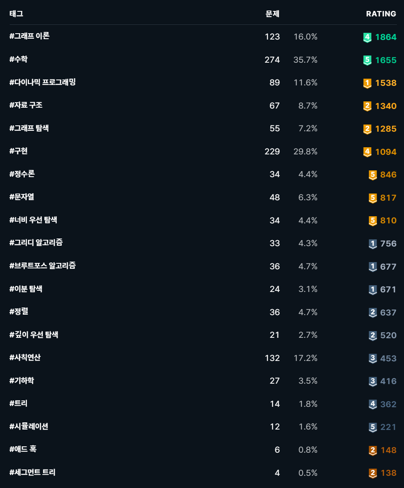

## 0423

정말 간만에 쓰는 TIL

그간 `solved.ac`에 많은 일이 있었다. 홀수와 짝수의 대결이 레이팅에서 빠져서 6점이나 떨어지고... 그리고 태그 레이팅이 생겼다.



 :angry: **어째서 이분 매칭이 없는가!** :angry:


## :heavy_exclamation_mark:(TLE) Music Festival - [백준 24281](https://www.acmicpc.net/problem/24281) 

2 SAT

```python
from sys import stdin, setrecursionlimit

input = stdin.readline
setrecursionlimit(3 * 10 ** 5)


def dfs(idx):
    visited[idx] = True
    for adj in graph[idx]:
        if not visited[adj]:
            dfs(adj)
    stack.append(idx)


def dfs_inv(idx):
    scc[idx] = component
    if scc[-idx]:
        if scc[-idx] == component:
            print('No')
            exit()
    elif idx > 0:
        ans[idx] = '2'
    for adj in graph[-idx]:
        if not scc[-adj]:
            dfs_inv(-adj)


n = int(input())
time = []
for i in range(1, n + 1):
    a, b, c, d = map(int, input().split())
    time.append((a, 0, i))
    time.append((b, 1, i))
    time.append((c, 0, -i))
    time.append((d, 1, -i))
time.sort()
graph = [[] for _ in range(2 * n + 1)]
t_set = set()
for _, s, i in time:
    if s:
        t_set.remove(i)
    else:
        for t in t_set:
            graph[i].append(-t)
            graph[t].append(-i)
        t_set.add(i)
del time
stack = []
visited = [False] * (2 * n + 1)
for i in range(1, n + 1):
    if not visited[i]:
        dfs(i)
    if not visited[-i]:
        dfs(-i)
scc = [0] * (2 * n + 1)
component = 0
ans = ['1'] * (n + 1)
ans[0] = 'Yes'
for now in stack[::-1]:
    if not scc[now]:
        component += 1
        dfs_inv(now)
del graph, stack
print('\n'.join(ans))
```

아무도 못 푼 문제를 쓰윽 둘러보던 중 찾았다. 2 SAT 로 해결 가능해보여서 풀어봤는데, n이 10만일 때 시간 초과가 발생한다. 아마 간선을 그리는 부분이 문제인 거 같은데... 좀 더 고민해보자.


## 욕심쟁이 판다 - [백준 1937](https://www.acmicpc.net/problem/1937)

DP

```python
from sys import stdin

input = stdin.readline

n = int(input())
dp = [[1] * n for _ in range(n)]
board = []
bamboo = []
for i in range(n):
    line = list(map(int, input().split()))
    for j in range(n):
        bamboo.append((line[j], i, j))
    board.append(line)
bamboo.sort()
dx = [1, -1, 0, 0]
dy = [0, 0, 1, -1]
ans = 1
while bamboo:
    size, x, y = bamboo.pop()
    for d in range(4):
        nx = x + dx[d]
        ny = y + dy[d]
        if 0 <= nx < n and 0 <= ny < n and board[x][y] < board[nx][ny]:
            if dp[x][y] < dp[nx][ny] + 1:
                dp[x][y] = dp[nx][ny] + 1
                if ans < dp[x][y]:
                    ans = dp[x][y]
print(ans)
```

DP 플레 달기 PJT 시작.

