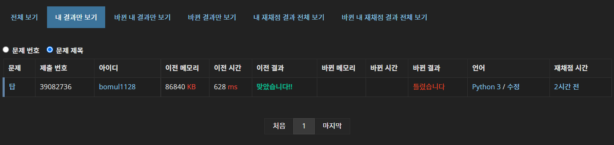

# 0511


## 탑 - [백준 2493](https://www.acmicpc.net/problem/2493)

스택

```python
from sys import stdin

input = stdin.readline

n = int(input())
tower = list(map(int, input().split()))
ans = [0] * n
stack = [(10 ** 8 + 1, 0)]
for i in range(n):
    h = tower[i]
    while stack[-1][0] < h:
        stack.pop()
    ans[i] = stack[-1][1]
    stack.append((h, i + 1))
print(*ans)
```



백준 푼 지 어연 4개월... 재채점으로 오답 처리를 처음 당해봤다.

보니까 2월 중순 쯤에 푼 골드 문제인데, 그 때 당시에 머리 쥐어짜면서 풀었던 기억이 난다. 그래서 약간 겁먹고 풀어보기 시작했는데, 웬걸 너무 쉬운 문제였다. 그 사이 실력이 늘었나 보다 ㅎㅎ 풀이 자체도 별거 없다. 그냥 스택 구조 사용하는 문제. 이분 탐색으로 `pop` 대신 슬라이싱으로 하는 방법도 해봤는데 오히려 시간 초과가 떴다.


## 나무 자르기 - [백준 13263](https://www.acmicpc.net/problem/13263)

DP, CHT

```python
from sys import stdin

input = stdin.readline

n = int(input())
h = list(map(int, input().split()))
c = list(map(int, input().split()))
dp = [0] * n
CHT = [(0, 0)]
for i in range(1, n):
    start = 0
    end = len(CHT) - 1
    while start <= end:
        mid = (start + end) // 2
        if CHT[mid][0] <= h[i]:
            res = CHT[mid][1]
            start = mid + 1
        else:
            end = mid - 1
    dp[i] = dp[res] + c[res] * h[i]
    if i < n - 1:
        while CHT[-1][0] >= (dp[i] - dp[CHT[-1][1]]) / (c[CHT[-1][1]] - c[i]):
            CHT.pop()
        CHT.append(((dp[i] - dp[CHT[-1][1]]) / (c[CHT[-1][1]] - c[i]), i))
print(dp[-1])
```

마지막 나무를 자르면 비용이 0이 되므로, n번째 나무를 자르기 위한 최소 비용으로 문제를 바꿔서 생각해 볼 수 있다. dp 점화식이 어떻게 되는지 확인해보면,
$$
\text{dp}[i] = \underset {j<i} {\min} (c[j] * h[i] + \text{dp}[j])
$$
위와 같이 되며 c는 내림차순, h는 오름차순이므로 컨벡스 헐 트릭을 사용할 수 있다.

이전 문제에서 진행한 CHT와 다른 점은, CHT를 갱신할 때 이분 탐색과 슬라이싱으로 찾는 것이 아닌, 뒤에서부터 확인해 `pop`해주었다. 그랬더니 시간이 반토막났다. 다음부턴 이렇게 쭉하자.