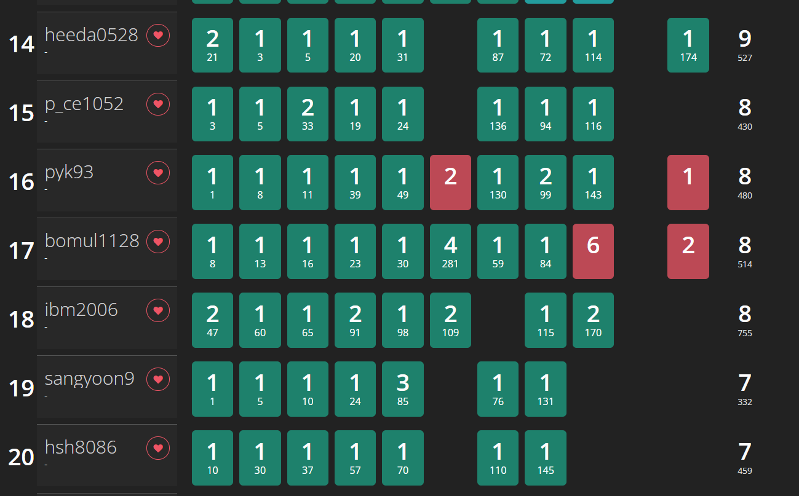

# 0514

## 제 1회 곰곰컵 - 백준 대회

> https://www.acmicpc.net/category/detail/3121

무려 600명이나 참여했다. 그 중 17등.

F번 문제는 PyPy로 제출할 생각을 하지 못해 헤맸다...

I번 문제는 처음에 유니온 파인드로 접근했다가 잘 안 됐다. 그래서 그래프 탐색 개념으로 풀면서 약간의 dp 메모이제이션까지 적용해줬는데, 그래도 시간 초과가 떴다. 좀 더 고민해보자.

H번 문제는 점화식은 어느 정도 유도했다고 생각했는데... 나중에 보니 포함 배제도 해야되고 난리가 나서 패스.

