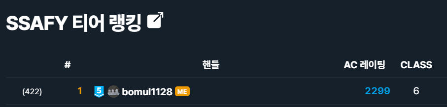

# 0521

3일 간 불태워서 장고 서버 개발은 거의 끝났다.

이제 프로필 페이지 Vue를 만져야 하는데... 격하게 하기 싫어서 알고리즘을 풀기로 했다.


## 스터디 그룹 - [백준 14572](https://www.acmicpc.net/problem/14572)

투 포인터, 약간의 그리디

```python
from sys import stdin

input = stdin.readline

n, k, d = map(int, input().split())
algo = []
student = []
for i in range(n):
    _, c = map(int, input().split())
    algo.append(set(map(int, input().split())))
    student.append((c, i))
student.sort()
start = 0
end = 0
ans = 0
known = [0] * (k + 1)
tk, wk = 0, 0
while end < n:
    if student[end][0] - student[start][0] > d:
        for a in algo[student[start][1]]:
            known[a] -= 1
            if known[a] == 0:
                tk -= 1
        start += 1
    else:
        for a in algo[student[end][1]]:
            known[a] += 1
            if known[a] == 1:
                tk += 1
        wk = known.count(end - start + 1)
        ans = max(ans, (end - start + 1) * (tk - wk))
        end += 1
print(ans)
```

투 포인터로 해결 가능하다. 그룹 내에서 알고리즘 실력이 가장 낮은 학생과 높은 학생 사이의 실력을 가지고 있는 학생을 무조건 영입하는게 이득이니까. 그래서 코딩 실력대로 정렬하고, 투 포인터로 가능한 스터디 그룹을 살펴보면서 가면 된다. 스터디 그룹 효율 계산을 위해 `known` 리스트를 만들었다. `known[i]`는 i번째 알고리즘을 몇 명의 학생이 그룹 내에서 알고 있는지를 의미한다. `k`의 범위가 최대 30이기 때문에 별 걱정 없이 `count` 내장 함수를 사용하여 그룹 내 모든 학생이 알고 있는 알고리즘의 개수를 구했다. 플레 5 문제라 그런지 무난하게 AC.


## 단방향 링크 네트워크 - [백준 3295](https://www.acmicpc.net/problem/3295)

이분 매칭

```python
from sys import stdin

input = stdin.readline


def dfs(idx):
    for adj in graph[idx]:
        if visited[adj]:
            continue
        visited[adj] = True
        if match[adj] == -1 or dfs(match[adj]):
            match[adj] = idx
            return 1
    return 0


for _ in range(int(input())):
    n, m = map(int, input().split())
    graph = [[] for _ in range(n)]
    for _ in range(m):
        x, y = map(int, input().split())
        graph[x].append(y)
    ans = 0
    match = [-1] * n
    for i in range(n):
        visited = [False] * n
        ans += dfs(i)
    print(ans)
```

문제 말이 어려워서 플2인 듯?

링은 전체 노드의 수만큼 득점하고, 선형 배열은 노드의 수 - 1만큼 득점하는 걸 잘 보면, 단순하게 매칭의 개수로 생각하면 된다는 걸 알 수 있다. 즉, 최대 매칭의 수가 정답.



알고리즘 시작한 지 5달... 싸피 1등 찍었다 ㅅㅅ


## 상어의 저녁식사 - [백준 1671](https://www.acmicpc.net/problem/1671)

이분 매칭

```python
from sys import stdin

input = stdin.readline


def check(x, y):
    if shark[x][0] <= shark[y][0] and shark[x][1] <= shark[y][1] and shark[x][2] <= shark[y][2]:
        return 1
    return 0


def dfs(idx):
    for adj in graph[idx]:
        if visited[adj]:
            continue
        visited[adj] = True
        if not match[adj] or dfs(match[adj]):
            match[adj] = idx
            return 1
    return 0


n = int(input())
shark = [0] + [tuple(map(int, input().split())) for _ in range(n)]
graph = [[] for _ in range(n + 1)]
for i in range(1, n):
    for j in range(i + 1, n + 1):
        if check(i, j):
            graph[i].append(j)
            graph[i].append(j + n)
        elif check(j, i):
            graph[j].append(i)
            graph[j].append(i + n)
ans = n
match = [0] * (2 * n + 1)
for i in range(1, n + 1):
    visited = [False] * (2 * n + 1)
    ans -= dfs(i)
print(ans)
```

왼쪽에 먹히는 상어, 오른쪽에 먹는 상어를 두어 이분 그래프를 그리고 매칭의 수를 찾아주면 된다. 이 때, 상어는 최대 2마리를 먹을 수 있으므로 오른쪽의 상어를 두 배 해주면 된다.

다 4 찍었다 ㅅㅅ