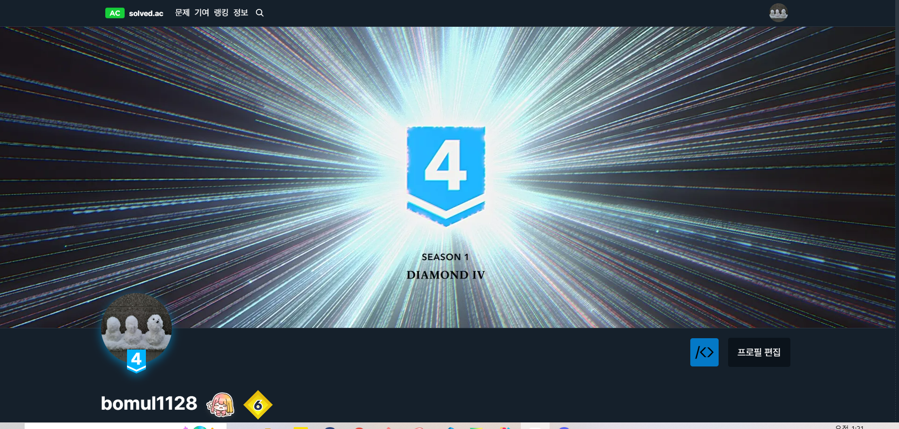

# 0605

solved.ac의 시즌1이 끝났다. 배경이 참 영롱하다.



문제 레이팅 방식에 변경이 생겼다고 한다. 원래 2326점이었는데 2318점으로 하락했다. 보니까 짐 정리, 아령, Cow sort 등 왜 다이아인지 이해 못하겠다는 문제들이 다 플레로 갔다. 그래 이게 맞지

오히려 특공대 문제는 다이아로 승격했다.


## flush

시작하기 앞서, Codeforce 대회에 에디토리얼이 올라온다는 사실을 이제서야 알았다. 나는 왜 지금까지 혼자 끙끙 앓았는가... 암튼 엊그제 대회 4 sol 깔끔하게 하고 5번 문제 들어갔다가 flush 쓰는 문제길래 에이씨하고 나왔는데, 에디토리얼을 보니까 그럴만한 게 아닌 것 같다.

아래 코드가 [5번 문제](https://codeforces.com/contest/1688/problem/E) 모범 답안되시겠다.

```python
n, m = map(int, input().split())
a = []
for i in range(m):
    print('?', '0' * i + '1' + '0' * (m - i - 1), flush=1)
    a.append(int(input()))
cur = 0
s = ['0' for i in range(m)]
for i in range(m):
    x = 0
    for j in range(m):
        if a[x] > a[j]:
            x = j
    s[x] = '1'
    print('? ', *s, sep='', flush=1)
    c = int(input())
    if cur + a[x] == c:
        cur += a[x]
    else:
        s[x] = '0'
    a[x] = 2000000
print('!', cur, flush=1)
```

정말 별거 없다. 오히려 의문이 생긴다. **왜 flush를 써야하는 건데?**

찾아보니 buffer라는 개념이 등장한다. 천천히 내가 이해한 걸 써보면,

1. 데이터 처리할 때 buffer가 꽉 차야 출력을 한다. 유튜브 영상을 예로 들면, 유튜브 버퍼링이 끝나고 나면 적어도 몇 분 간은 버퍼링이 없다. 즉, buffer만큼의 영상이 내 핸드폰에 전송이 완료된 것이다. Python도 같은 방식이라는 듯. 데이터 유효성, 연속성 등 때문에 이렇게 하는 듯? 아님 말구.
2. 기존의 print는 buffer가 꽉 차야 출력한다. 하지만, `flush`를 써주면 buffer를 거치지 않고 바로 출력한다.

이러고 나니 또 의문이 생겼다. **그럼 알고리즘 문제는 항상 `flush` 쓰면 되는 거 아님??**

흠... 알고리즘 문제 풀 때 print 값의 유효성 검사는 정말 필요없을 거고... 잘 모르겠다. 일단 백준 게시판에 질문글 올리긴 했는데 답변이 달리긴 하련지...

 

