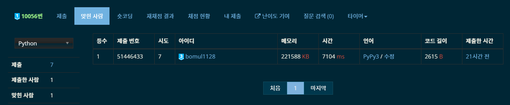

# 11월 8일

어제 다이아1 문제를 풀고, 오늘도 다이아1 문제를 풀어버렸다. 그래서 TIL을 안 쓸 수가 없었다.

얼마만에 쓰는 평일 TIL인지...


## Metal Processing Plant - [백준 10056](https://www.acmicpc.net/problem/10056)

> 2SAT, 이분 탐색, 분리 집합

어제 푼 문제이다. 자려고 누운 뒤 유튜브 보다가 갑자기 [추천 영상](https://www.youtube.com/watch?v=PMBN5hZA9LI)에 떴다. 보니까 이미 북마크 설정해놓고 풀어보려던 문제였어서 금방 이해가 됐다. 앞에 한 5분 보다가 풀이가 생각나서 바로 코딩을 시작했다. 이게 새벽 2시.

하지만 괜히 다이아1이 아니었다. 생각보다 빡셌다. 다 짜고 제출해보니 새벽 4시 반... 시간 초과가 났다.

``` Python
# TIL
n = int(input())
edges = {0: []}
for i in range(1, n):
    for j, c in enumerate(map(int, input().split())):
        if edges.get(c):
            edges[c].append((i, i + j + 1))
        else:
            edges[c] = [(i, i + j + 1)]
if n < 3:
    print(0)
    exit()
key = list(edges.keys())
key.sort()
ans = float('inf')
for p in range(len(key)):
    start = 0
    end = p
    while start <= end:
        mid = (start + end) // 2
        graph = [[] for _ in range(2 * n + 1)]
        for i in range(mid + 1, p + 1):
            for x, y in edges[key[i]]:
                graph[x].append(-y)
                graph[y].append(-x)
        for i in range(p + 1, len(key)):
            for x, y in edges[key[i]]:
                graph[x].append(-y)
                graph[-x].append(y)
                graph[y].append(-x)
                graph[-y].append(x)
        visited = [False] * (2 * n + 1)
        stack = []
        for i in range(1, n + 1):
            if not visited[i]:
                dfs(i)
            if not visited[-i]:
                dfs(-i)
        scc = [0] * (2 * n + 1)
        component = 0
        while stack:
            now = stack.pop()
            if not scc[now]:
                component += 1
                dfs_inv(now)
        flag = True
        for i in range(1, n + 1):
            if scc[i] == scc[-i]:
                flag = False
                break
        if flag:
            if ans > key[mid] + key[p]:
                ans = key[mid] + key[p]
            end = mid - 1
        else:
            start = mid + 1
print(ans)
```

여기까지 어떤 풀이를 했는지 살펴보자. 영상에서 설명해준 부분은, D<sub>A</sub>보다 크거나 같은 D<sub>B</sub>에 대해서, D<sub>B</sub>의 값을 고정한다. 그 다음 D<sub>A</sub>를 0 ~ D<sub>B</sub> 범위에서 이분 탐색을 해준다. 각각의 탐색에서, 해당 D<sub>A</sub>와 D<sub>B</sub>를 만족하는 두 집합이 존재하는지 판별한다. 이건 2SAT로 구현이 가능하다. 

```Python
for i in range(mid + 1, p + 1):
    for x, y in edges[key[i]]:
        graph[x].append(-y)
        graph[y].append(-x)
for i in range(p + 1, len(key)):
    for x, y in edges[key[i]]:
        graph[x].append(-y)
        graph[-x].append(y)
        graph[y].append(-x)
        graph[-y].append(x)
```

간선은 이런 식으로 그려주면 된다. 간선 정보를 보고 양 끝 점이 어느 집합에 속해있는 구조여야 하는지 생각해보면 쉽게 떠올릴 수 있다.

하지만 안타깝게도 시간 초과가 나왔다. 왜냐하면, 

> 모든 간선(n^2)에 대해 이분 탐색 (2SAT, O(n^2))을 log(n^2) 만큼 한다.

즉 시간복잡도가 O(n^4 * log n)가 된다. n이 200 밖에 안 돼서 이런 점을 고려하지 않고 구현했다... 

줄일 수 있는 부분을 찾아봐야하는데,

1. 여기서 2SAT는 O(n^2) 고정이다.
2. 여기서 이분 탐색을 최적화할 방법은 딱히 없는 듯 하다.
3. 따라서 모든 간선을 살펴보는 것이 시간 초과의 원인이다.

그렇다면 간선을 어디까지 살펴보는 것이 좋을 지 생각해보자. 쉽게 생각했을 때, 방법은 2가지 있을 것이다.

1. D<sub>A</sub>의 범위에 제한을 둘 수 있다.
2. D<sub>B</sub>의 범위에 제한을 둘 수 있다.

D<sub>A</sub>는 D<sub>B</sub>에 대해 종속적?(더 좋은 표현이 생각나지 않는다. 암튼 독립적이지 않다)이기 때문에, D<sub>B</sub>의 범위에 제한을 두는 것이 맞을 것 같다.

최대 스패닝 트리를 그린다고 생각해보자. 여기에 최대 스패닝 트리에서 사용하지 않은 간선 중에, 그리면 홀수 사이클이 생기는, 그 중에 가장 비싼 간선 e를 생각해보자. 이 때, **홀수 사이클 내부의 간선 중 하나는 반드시 A 또는 B 안에 포함되게 된다.** 즉, 간선 e의 비용을 c라 했을 때, c는 D<sub>B</sub>보다 반드시 작거나 같다! 이제 간선 비용을 역순으로 탐색을 하면서, 간선을 사용하다가 홀수 사이클이 생기는 순간까지만 탐색을 하면 된다! 그리고 이건 간선을 n개만 살피게 되므로, O(n^3 * log n)의 풀이가 탄생한다.

그럼 이제 MST + e를 어떻게 그릴지 생각해봐야 한다. 평소하던대로 크루스칼 때리면 되지만, 홀수 사이클이 생기는 순간을 판별해야 한다. 내가 사용한 방법은, 1 ~ n^2 까지에 대해서만 그리는게 아니라, -1 ~ -n^2에 대해서도 트리를 한꺼번에 그리는 것이다. 역순으로 간선을 살펴볼 때, 해당 간선(a to b)을 MST + e에 사용한다면, a와 b의 색깔은 다르게 칠해져야 한다.(홀수 사이클 설명할 때 주로 나오는 색깔 개념을 사용하겠다.) 즉, a와 -b, 그리고 b와 -a를 union 해주면 된다. 이렇게 MST + e를 그리다가, a와 -a가 같은 parents를 가질 때 종료하면 된다.

여기까지만 하면 될 줄 알았는데... 또 시간 초과가 나왔다. 이론은 완벽하거늘... 파이썬이라 당했다... 이런 생각하다가, 문제점을 찾았다. 같은 비용의 간선들의 집합들을 모두 살펴봤는데 MST + e 그래프에 유의미한 간선은 그리지 않았을 때, 즉 union이 일을 안 했을 때는 해당 비용을 탐색할 필요가 없었다! 그래서, union - 이분탐색 - find 순으로 탐색을 진행하도록 수정했다.

```Python
... # 기본 설정 코드
for p in range(len(key) - 1, -1, -1):
    flag = False
    for x, y in edges[key[p]]:
        fx, mfx, fy, mfy = find(x), find(-x), find(y), find(-y)
        if fx != mfy:
            parents[mfy] = fx
            flag = True
        if fy != mfx:
            parents[mfx] = fy
            flag = True
    if flag:
      ... # 이분 탐색 2SAT 
      for i in range(1, n + 1):
          if find(i) == find(-i):
              print(ans)
              exit()
print(ans)      
```

그리고 AC를 받아냈다!



추가로, 파이썬으로 유일하게 정답을 맞춘 사람이 됐다. 애초에 파이썬으로 다1을 제출하는 바보가 나밖에 없었지만... 그래도 기분은 좋다 ㅎㅎ

2SAT 북마크 문제를 해결해서, 북마크에 있던 다른 2SAT 문제(다음 문제)를 고민하면서 어제 잠들었는데, 생각보다 할만할 것 같다는 생각이 들어 오늘 도전했다. 


## Dev, Please Add This! - [백준 14737](https://www.acmicpc.net/problem/14737)

> 2SAT, 구현

1
