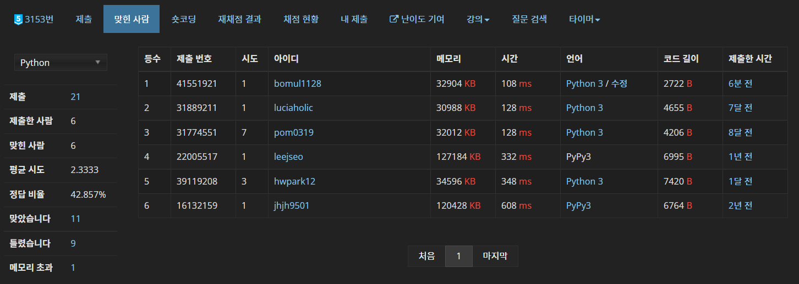

# 0405


## :diamond_shape_with_a_dot_inside: 타워 디펜스 - [백준 3153](https://www.acmicpc.net/problem/3153)

2 SAT

```python
from sys import stdin
from collections import defaultdict

input = stdin.readline


def trans(idx, direction):
    if direction == 0:
        return 2 * idx - 1
    if direction == 1:
        return -(2 * idx - 1)
    if direction == 2:
        return 2 * idx
    if direction == 3:
        return -2 * idx


def draw_edge(arr):
    l = len(arr)
    if l == 1:
        graph[-arr[0]].add(arr[0])
    elif l == 2:
        graph[-arr[0]].add(arr[1])
        graph[-arr[1]].add(arr[0])
    else:
        print('Something Wrong')


def dfs(idx):
    if visited[idx]:
        return
    visited[idx] = True
    for adj in graph[idx]:
        if not visited[adj]:
            dfs(adj)
    stack.append(idx)


def dfs_inv(idx):
    if scc[idx]:
        return
    scc[idx] = component
    for adj in graph[-idx]:
        if not scc[-adj]:
            dfs_inv(-adj)


def check(idx):
    right = True
    down = True
    if scc[2 * idx] < scc[-2 * idx]:
        right = False
    if scc[2 * idx - 1] < scc[-2 * idx + 1]:
        down = False
    if right:
        if down:
            direction = '2'
        else:
            direction = '3'
    else:
        if down:
            direction = '1'
        else:
            direction = '4'
    tx, ty = tower[idx]
    board[tx][ty] = direction


n, m = map(int, input().split())
tower = [0]
tn = 0
board = [list(input().strip()) for _ in range(n)]
for i in range(n):
    for j in range(m):
        if board[i][j] == 'T':
            tn += 1
            board[i][j] = tn
            tower.append((i, j))
graph = [set() for _ in range(4 * tn + 1)]
clone = defaultdict(list)
dx = [1, -1, 0, 0]
dy = [0, 0, 1, -1]
for i in range(1, tn + 1):
    x, y = tower[i]
    for d in range(4):
        now = trans(i, d)
        nx, ny = x, y
        stack = []
        while True:
            nx += dx[d]
            ny += dy[d]
            if 0 <= nx < n and 0 <= ny < m:
                if board[nx][ny] == '#':
                    break
                elif type(board[nx][ny]) == int:
                    stack = []
                    graph[now].add(-now)
                    break
                elif board[nx][ny] == 'n':
                    stack.append((nx, ny))
            else:
                break
        for p in stack:
            clone[p].append(now)
for able in clone.values():
    draw_edge(able)
stack = []
visited = [False] * (4 * tn + 1)
for i in range(1, 2 * tn + 1):
    if not visited[i]:
        dfs(i)
    if not visited[-i]:
        dfs(-i)
scc = [0] * (4 * tn + 1)
component = 0
while stack:
    now = stack.pop()
    if not scc[now]:
        component += 1
        dfs_inv(now)
for i in range(1, tn + 1):
    check(i)
for line in board:
    print(''.join(line))
```



**SCC는 전설이다... 2 SAT는 무적이고...**

크으 이제 다이아 문제도 1트 클하는 경지에 다다랐다. 

[L퍼즐](https://www.acmicpc.net/problem/3654) 하위 호환이다. 타워 기준으로 상하좌우 탐색을 해 타워를 만나면 해당 방향이 거짓이라는 간선을, 클론을 만나면 클론에 해당 방향을 마킹해줬다. 이 때 클론을 만난 뒤 타워를 만나는 상황을 예외 처리해주어야 한다. 그 이후론 전형적인 2 SAT다. 나만의 2 SAT 코드는 볼 때마다 맘에 든다 ㅎㅎ **코사라주로 하지만 역방향 그래프가 없다!** 아 기분 좋아

