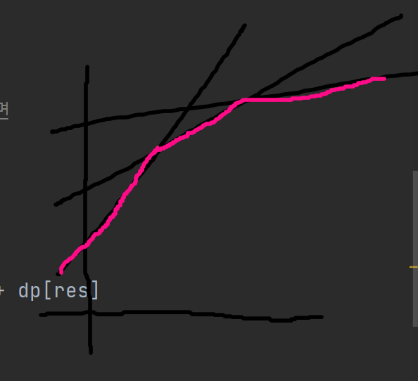

# 0508


## 데이터 체커 - [백준 22942]()

스위핑

```python
from sys import stdin

input = stdin.readline

n = int(input())
ans = 0
circles = []
for _ in range(n):
    c, r = map(int, input().split())
    circles.append((c - r, c + r))
circles.sort()
stack = []
ans = 'YES'
for s, e in circles:
    while stack and stack[-1][1] < s:
        stack.pop()
    if stack:
        if stack[-1][1] <= e:
            ans = 'NO'
            break
    stack.append((s, e))
print(ans)
```

원의 중심 위치에 제약이 없었다면 꽤나 어려웠겠지만, 모든 원 중심이 x축 위에 있다는 조건 덕에 쉽게 해결할 수 있다. 두 원의 위치 관계를 너무 어렵게 생각할 것 없이, 원의 지름을 구간으로 생각하여 두 구간이 서로 독립되거나, 다른 구간에 종속되면 된다. 구간들을 리스트에 다 담은 뒤, 시작 지점을 기준으로 정렬하여 확인해주면 된다. 일반적인 풀이라면 모든 구간들을 확인하며 O(n<sup>2</sup>)이 걸렸겠지만, 정렬 후 스위핑 기법을 사용하면 정렬에 소요되는 O(n log n)이 시간복잡도로 해결 가능하다.


## 볼록 껍질을 이용한 DP 최적화 (Convex Hull  Trick)

> 꽤 여러 사이트 글을 읽었는데, 제일 이해가 잘 된 건 https://m.blog.naver.com/kks227/221418495037 였다.

DP의 끝은 어디인가... 비트마스킹 DP를 풀었던 게 엊그제 같은데...

갑자기 새로운 알고리즘 공부를 하고 싶어졌다. 백준 문제집을 뒤지던 중 '동적 계획법을 최적화하는 9가지 방법'이라는 [문제집](https://www.acmicpc.net/workbook/view/4301)을 발견했다. 그 중 한 달 전에 시도했다가 시간 초과한 문제를 찾았다. 오늘은 이걸 마스터해보자.

이름부터 기괴하다. 볼록 껍질은 기하에서나 듣던 것인데... Convex Hull Trick, 줄여서 CHT라고 많이 쓰더라. 이 방법은 단조 증가 / 감소 수열에 대해 DP를 계산할 때만 가능하다(정확히 말하자면, 일단 내가 이해한 범위 내에서는 단조 증가/감소 수열만 가능하다). 일반성을 잃지 않고 단조 감소 수열 A<sub>i</sub>에 대해 DP 갱신이 아래와 같이 이루어지는 상황을 생각해보자.
$$
\text {dp}[\ i \ ] = {\underset {j \ < \ i} {\min}} \ (A_j * B_i + \text {dp}[\ j \ ])
$$
원래라면 아래와 같이 할 것이다.

```python
for j in range(i):
    dp[i] = min(dp[i], a[j] * b[i] + dp[j])
```

`dp[n]`을 계산해야하는 상황을 생각해보자. 위 방법은 O(n<sup>2</sup>) 이 걸린다. 하지만 우리의 CHT께서는 O(n log n)에 해결할 방법을 가지고 있으시단다. DP 점화식을 다시 보자. dp[i]를 갱신할 때, **i에 관한 값은 고정이며, j 값만 변하는 것을 확인할 수 있다.** 상당히 뜬금없지만, 일차 함수 식 y = A<sub>j</sub> x + dp[j] 를 모든 j에 대해 그려보자.



편의상 직선 3개만 그렸다. **빨간 볼록 껍질은, 어떤 x값이 들어왔을 때 최소값이 어디에 있는지를 표시한 것이 된다.** 그리고 `dp[i]` 갱신할 때 뿐만 아니라, `dp[i+1]`을 갱신할 때도 위의 정보에 직선 하나를 추가해 사용할 수 있다. 이제 어떤 일차함수가 어느 구간에서 제일 아래에 있는지를 저장해 줄 `stack`을 만들면 된다. 그리고 x에서의 최소값을 구할 때는 `stack`에서 이분 탐색을 해 어느 구간에 속하는 지 찾을 수 있다. 즉, `dp[i]` 갱신을 log i 만에 해낼 수 있게 됐다!

`stack`을 갱신할 때(직선 하나를 추가할 때)도, `stack`에서 이분 탐색을 해 새로운 직선과의 교점이 해당 구간 안에 존재하는 구간을 찾아, 바로 뒤에 직선식을 추가해주면 된다. 그 뒤의 직선식은 버려주자. 여기서 주의할 점은, **스택의 맨 뒤에 추가하는 것이 아니다. 직선식이 추가됨에 따라 더이상 사용할 필요가 없는 직선식이 생길 수 있다.**

후... 이해하는 데에 2시간 정도 쓴 것 같다. 이제 문제를 풀어보자.


## :diamond_shape_with_a_dot_inside: 땅따먹기 - [백준 6171](https://www.acmicpc.net/problem/6171)

DP, CHT

```python
from sys import stdin

input = stdin.readline

n = int(input())
goods = [tuple(map(int, input().split())) for _ in range(n)]
goods.sort()
real = [0, goods.pop()]
while goods:
    now = goods.pop()
    if real:
        if real[-1][0] > now[0] and real[-1][1] < now[1]:
            real.append(now)
        elif real[-1][1] < now[1]:
            real.pop()
            real.append(now)
l = len(real)
dp = [0] * l
CHT = [(0, 0)]
# (컨벡스 헐 시작점, i with 기울기=h_(i + 1), y절편=dp[i])
# real[j] = hj, wj
CHT = [(0, 0)]
for i in range(1, l):
    start = 0
    end = len(CHT) - 1
    while start <= end:
        middle = (start + end) // 2
        # 볼록 껍질 직선의 시작점이 wi 보다 작다면
        if CHT[middle][0] <= real[i][1]:
            res = CHT[middle][1]
            start = middle + 1
        else:
            end = middle - 1
    dp[i] = real[res + 1][0] * real[i][1] + dp[res]
    if i < l - 1:
        start = 0
        end = len(CHT) - 1
        a2, b2 = real[i + 1][0], dp[i]
        while start <= end:
            middle = (start + end) // 2
            now = CHT[middle][1]
            a1, b1 = real[now + 1][0], dp[now]
            # 시작점 뒤 쪽에 교점이 나온 경우
            s = (b2 - b1) / (a1 - a2)
            if s > CHT[middle][0]:
                res = middle
                ns = s
                start = middle + 1
            else:
                end = middle - 1
        CHT = CHT[:res + 1] + [(ns, i)]
print(dp[-1])
```

주석을 쓰면서 문제를 푼 게 얼마만인지... 암튼 다이아 DP문제를 풀었다 흐헤헤

가로, 세로 모두 다른 직사각형보다 작은 직사각형은 볼 필요가 없다. 정렬 후 스위핑으로 우리가 봐야할 직사각형만 걸러주자. 그 다음은 CHT로 해결하면 된다. 
