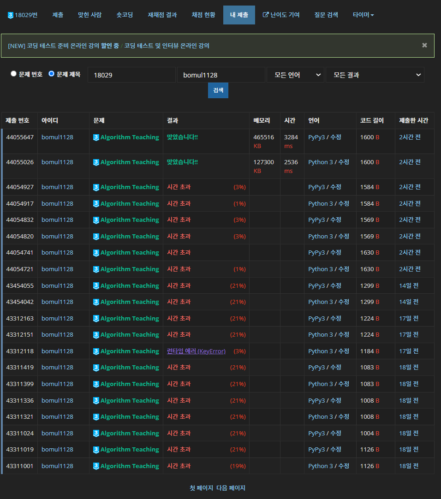

# 0601


## 호프크래프트 카프 알고리즘

```python
from sys import stdin
from collections import deque

input = stdin.readline
INF = float('inf')


def bfs():
    stack = deque()
    for x in range(1, n + 1):
        if not used[x]:
            stack.append(x)
            dist[x] = 0
        else:
            dist[x] = INF
    while stack:
        now = stack.popleft()
        for adj in graph[now]:
            if match[adj] and dist[match[adj]] == INF:
                dist[match[adj]] = dist[now] + 1
                stack.append(match[adj])


def dfs(idx):
    for adj in graph[idx]:
        if not match[adj] or (dist[match[adj]] == dist[idx] + 1 and dfs(match[adj])):
            used[idx] = True
            match[adj] = idx
            return 1
    return 0


n, m = map(int, input().split())
graph = [[] for _ in range(n + 1)]
for i in range(1, n + 1):
    _, *j = map(int, input().split())
    graph[i] = j
match = [0] * (m + 1)
used = [False] * (n + 1)
dist = [0] * (n + 1)
ans = 0
while True:
    bfs()
    flow = 0
    for i in range(1, n + 1):
        if not used[i]:
            flow += dfs(i)
    if flow:
        ans += flow
    else:
        break
print(ans)
```

> 참고 링크 : [Ries 마법의 슈퍼마리오 블로그]
>
> https://blog.naver.com/PostView.nhn?isHttpsRedirect=true&blogId=kks227&logNo=220816033373


[백준 2188 축사 배정](https://www.acmicpc.net/problem/2188)의 코드이다. 지금까지 이분 매칭을 디닉 알고리즘(내가 평소에 하던 거 이름이 디닉이란다.)으로 했었다. 4월 초에 처음으로 호프크로프트 카프 알고리즘을 접했는데, 오늘 작정하고 코드 뜯어보면서 이해하는데 성공했다. 

그래프 이론 수업에서 alternative path 공부했던 거를 생각하면 된다. 매칭되지 않은 점에서 시작해 홀수 길이의 alternative path가 존재한다면, 매칭을 1 늘릴 수 있다는 것이 이 알고리즘의 핵심이다. 그림 그려보면 쉽게 증명 가능하다. path에 포함된 간선 중 매칭된 간선은 매칭을 없애고, 나머지는 매칭으로 만들어주면 된다.

`bfs` 함수는 이런 alternative path를 찾아주기 위한 밑 작업이다. `dist` 리스트는 매칭에 포함되지 않은 점을 0으로 하고, 이후 길이 n * 2의 alternative path로 방문한 점에 n을 저장한다. 처음에 실수했던 건, 갱신할 때 덱이 아닌 스택 구조로 구현했다. 함수 이름부터 bfs인데 왜 이런 미친 짓을 했는지 모르겠지만, 조심하자.

bfs 후에는 다음 dfs로 매칭을 하는데, 이제 이 매칭은 alternative path에 대해서만 갱신을 해준다. 그래서 평소에 하던 디닉에 비해서 아래 부분이 추가됐다

```python
def dfs(idx):
    ...
	if not match[adj] or (dist[match[adj]] == dist[idx] + 1 and dfs(match[adj])):
    	...
```

원래 전체 탐색으로 찾아줬다면, 이제는 증가 경로 상의 다음 점만 보겠다는 것이다. 당연히 디닉보다 탐색 범위가 많이 줄어들 것이다.

하지만, 축사 배정 같은 문제에서는 오히려 호프크로프트 카프가 더 오래 걸렸다. 구현 코드의 차이일 지는 몰라도, 점의 개수가 충분히 작다면 `bfs` 함수를 수행하는 과정이 없는 디닉이 더 빠르게 처리할 수 있는 게 아닐까 의심해본다. 암튼, 호프크로프트 카프까지 정복했으니 이제 이분 매칭 문제는 두려울 게 없다.


## Algorithm Teaching - [백준 18029](https://www.acmicpc.net/problem/18029)

이분 매칭

```python
from sys import stdin, setrecursionlimit
from collections import defaultdict, deque

input = stdin.readline
setrecursionlimit(2 * 10 ** 5)
INF = float('inf')


def bfs():
    stack = deque()
    for x in nodes:
        if not used[x]:
            stack.append(x)
            dist[x] = 0
        else:
            dist[x] = INF
    while stack:
        now = stack.popleft()
        for adj in graph[now]:
            if match[adj] and dist[match[adj]] == INF:
                dist[match[adj]] = dist[now] + 1
                stack.append(match[adj])


def dfs(idx):
    for adj in graph[idx]:
        if not match[adj] or (dist[match[adj]] == dist[idx] + 1 and dfs(match[adj])):
            used[idx] = True
            match[adj] = idx
            return 1
    return 0


graph = defaultdict(set)
nodes = set()
for _ in range(int(input())):
    m, *algo = input().strip().split()
    m = int(m)
    algo.sort()
    if ''.join(algo) not in nodes:
        memo = [''] * (1 << m)
        for btmsk in range((1 << m) - 1, 0, -1):
            for bit in range(m):
                if btmsk & (1 << bit):
                    memo[btmsk] += algo[bit]
            nodes.add(memo[btmsk])
            for bit in range(m):
                if btmsk & (1 << bit) == 0:
                    graph[memo[btmsk]].add(memo[btmsk + (1 << bit)])
match = defaultdict(bool)
used = defaultdict(bool)
dist = defaultdict(int)
ans = len(nodes)
while True:
    bfs()
    flow = 0
    for node in nodes:
        if not used[node]:
            flow += dfs(node)
    if flow:
        ans -= flow
    else:
        break
print(ans)
```



> 이분 매칭 관련 자료 : [삼성 멤버쉽] 최대 이분 매칭에 관한 몇 가지 정리, Acka1357
>
> http://www.secmem.org/blog/2019/12/15/theorem-about-bipartite-matching/

사진 하나만 봐도 얼마나 고생했는지 알 수 있다...

진작에 이분 매칭으로 풀 수 있다는 걸 알았던 문제이다. 문제만 읽어보면 왜 이분 매칭인지 알기 어렵다. 일단 천천히 그래프를 그려보자. 어떤 선생에 대해 나올 수 있는 알고리즘 부분집합들의 집합에 대해서, 어떤 부분집합 자기 자신을 포함하면서 크기가 1 큰 다른 부분집합 간에 간선을 그려주자. 이 때 간선에 방향성이 존재한다. 이렇게 되면, (부분)집합들이 여러 방향성 있는 간선으로 이어져 있게 된다. 자명하게, 그 간선들 간에는 사이클이 존재하지 않는다.  

여기서 딜워스의 정리가 나온다. 사이클이 없는 방향 그래프(줄여서 DAG라고 많이 쓴다)에서, maximum anti chain의 크기는 minimum path cover와 같다는 정리이다. 여기서 anti chain이란, 서로 간에 위상이 없는 점들의 집합이다. 다르게 말하면, 집합 내의 어느 점에서 출발해 간선을 통해 다른 모든 점으로 갈 수 없는 것이다. maximum anti chain은 말 그대로 이런 집합의 최대 크기이다. 다시 문제로 돌아오면, 우리 상황과 굉장히 비슷하다. 우리가 그린 그래프에서 원하는 정답은 maximum anti chain임을 알 수 있다. 그리고 딜워스의 정리에 의해 우리는 그래프의 minimum path cover를 구하면 된다.

minimum path cover를 구하는 문제는 몇 번 풀어봤다. 노드들을 양 쪽에 모두 그리고, 이어져 있는 노드들 간에 간선을 그린 뒤 이분 매칭을 해준다. minimum path cover는 전체 노드의 개수에서 최대 매칭을 빼주면 된다.

드디어 문제가 이분 매칭 문제로 바뀌었다. 이제 문제는 부분집합을 만드는 것인데, 서로 다른 선생들 간에 같은 부분집합이 존재할 수 있었다. 그래서 만일 이미 처리한 부분집합이 나온다면, 더 이상 그 부분집합의 부분집합은 처리하지 않도록 해주었다. 그리고 알고리즘 개수가 몇 개인지 모르고, dictionary의 key 값으로 쓰기 위해 string 형태로 부분집합을 나타냈다. 그래서 `sort`하고 `join`해서 부분집합을 만들었다. 여기까지가 15일 전에 했던 거다. 이분 매칭을 디닉으로 구현했으나 계속 시간 초과가 떠 왜 안 되냐 이게... 거리고 있었다.

그리고 오늘, 드디어 호프크로프트 카프를 이해했다. 이해하자마자, 이 문제가 생각나서 코드를 다시 제출했다. 그리고 결국 AC. 파이썬으로 푼 사람은 나 밖에 없는 것 같아 더욱 뿌듯하다. 인터넷 상에도 이해하기 쉬운 편의 파이썬으로 짠 호프크로프트 카프 알고리즘이 없는 거 같다. 일단 내가 못 찾았다...

