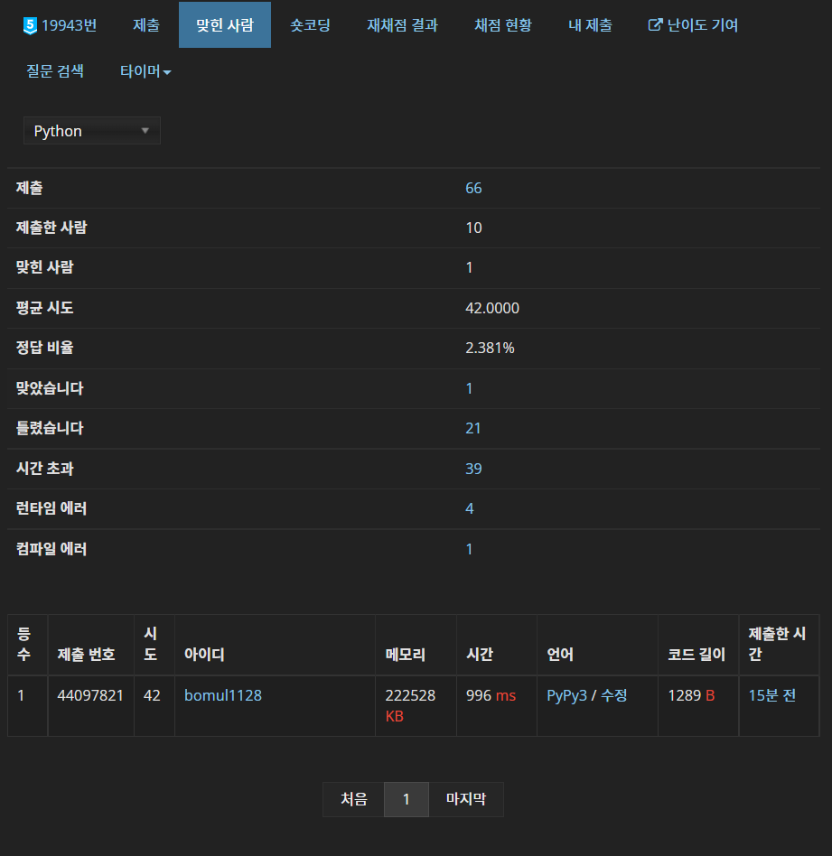

# 0602


## 특공대 - [백준 4008](https://www.acmicpc.net/problem/4008)

DP, CHT, 누적 합

```python
from sys import stdin

input = stdin.readline

n = int(input())
a, b, c = map(int, input().split())
cp = [0] + list(map(int, input().split()))
for i in range(1, n + 1):
    cp[i] += cp[i - 1]
dp = [0] * (n + 1)
cht = [(-float('inf'), 0)]
for i in range(1, n + 1):
    start = 0
    end = len(cht) - 1
    while start <= end:
        mid = (start + end) // 2
        if cht[mid][0] <= cp[i]:
            res = cht[mid][1]
            start = mid + 1
        else:
            end = mid - 1
    t = cp[i] - cp[res]
    dp[i] = dp[res] + a * t * t + b * t + c
    for res in range(len(cht) - 1, -1, -1):
        s, k = cht[res]
        t = (dp[i] - dp[k] + a * (cp[i] * cp[i] - cp[k] * cp[k]) - b * (cp[i] - cp[k]))
        t /= 2 * a * (cp[i] - cp[k])
        if t > s:
            break
        else:
            cht.pop()
    cht.append((t, i))
print(dp[-1])
```

$$
x_{i,j}=\text {cp} [i ] - \text {cp} [j] \\
\text {dp}[i] = 
 {\underset {j \ < \ i} {\max}} \ \{ a{x_{i,j}}^2 + bx_{i,j} + c + \text {dp}[j] \}
$$

위와 같은 식을 세울 수 있다. `cp`를 누적 합 리스트로 만들었고, 개개인 별 초기 전투 능력치가 양수 이기 때문에 `cp[i]`는 증가 수열이다. 즉, 전형적인 CHT 문제 임을 알 수 있다. 이제 `max` 안에 필요한 정보만 남기고 다시 식을 정리해보자.
$$
x = \text {cp} [i] \\
\text {dp}[i] = 
 {\underset {j \ < \ i} {\max}} \ \{ (-2a \times \text {cp}[j]) x 
 + a \times {\text {cp}[j]}^2 - b \times \text {cp} [j] + \text {dp}[j] \}
 + a \times {\text {cp}[i]}^2 + b \times {\text {cp}[i]}+ c
$$
`max` 함수 내의 변수를 `cp[i]`, 즉 갱신할 차례의 인덱스까지의 전투력 누적합이 변수로 설정했다. `max` 함수가 일차 함수가 됐으니 이제 CHT를 진행하면 된다. 평소랑 비슷하게 이분 탐색으로 적용할 일차 함수를 찾고, 뒤에서부터 탐색을 해 일차 함수 내역을 갱신했다.

처음 CHT를 공부했을 때 플레1 문제였는데, 오늘 보니 다이아 문제가 되어있었다. 개인적으로 다이아 CHT 문제들보다 고민 포인트가 훨씬 적었던 거 같아서, 플레1로 난이도 제출했더니 다시 플레1이 되었다. 지금 딱 경계선에 있는 듯?

CHT 문제는 정말 종이 없이는 못 풀 거 같다. 약간 고등학교 수능 수학 푸는 느낌?


## :diamond_shape_with_a_dot_inside: 조명등 - [백준 19943](https://www.acmicpc.net/problem/19943)

DP, CHT, 스택

```python
from sys import stdin

input = stdin.readline

mod = (".00", ".25", ".50", ".75")
for _ in range(int(input())):
    n = int(input())
    statue = [(-10 ** 8, 0)]
    for _ in range(n):
        x, h = map(int, input().split())
        while statue:
            if statue[-1][0] >= x - h:
                statue.pop()
            else:
                break
        if statue[-1][1] < x + h:
            statue.append((x - h, x + h))
    l = len(statue)
    dp = [0] * l
    CHT = [(-float('inf'), 0)]
    for i in range(1, l):
        start = 0
        end = len(CHT) - 1
        while start <= end:
            mid = (start + end) // 2
            if CHT[mid][0] <= statue[i][1]:
                res = CHT[mid][1]
                start = mid + 1
            else:
                end = mid - 1
        dp[i] = dp[res] + (statue[i][1] - statue[res + 1][0]) ** 2
        if i < l - 1:
            for j in range(len(CHT) - 1, -1, -1):
                s, k = CHT[j]
                x = dp[i] - dp[k] + statue[i + 1][0] ** 2 - statue[k + 1][0] ** 2
                x /= 2 * (statue[i + 1][0] - statue[k + 1][0])
                if x < s:
                    CHT.pop()
                else:
                    break
            CHT.append((x, i))
    print(str(dp[-1] // 4) + mod[dp[-1] % 4])
```



파이썬을 위한 문제가 아니다.. 42트 끝에 해냈다.

두 가지 문제가 있었다.

1. **소수점 둘째 자리까지 출력 이슈**

   대충 답을 다 구하고, 나누기 4하는 방식을 하면 안 된다. 파이썬이 매우 큰 수에 대해 소수점 아래 숫자들을 인식 안하는 듯하다. 그래서 스트링으로 바꾸고 뒤에 소수점을 달아줬다. (`mod[dp[-1] % 4]`)

2. **파이썬을 위한 문제가 아니다.**

   파이썬 제출 이력을 보면 꽤 쟁쟁한 분들이 제출했는데, 다들 실패했다. 시간 제한이 파이썬에게는 빡빡해도 너무 빡빡하다. 나중엔 오기가 생겨 시간을 잡아보려 별다별 짓을 다 해봤다.

   - `CHT` 갱신을 이분 탐색으로 진행하기

     옛날에 전령들 문제에서 했던 거처럼 해봤다. 근데 시간 초과.

   - `CHT` 를 길이만큼 미리 만들어놓기

     오히려 시간 초과가 났다. 이유는 불명.

   - `stdout.write` 쓰기

   - 이외 여러가지 방법들...

그러다 어이없는 방법으로 성공했다. 원래 정답을 출력하는 부분이 아래와 같았다.

```python
    ans = str(dp[-1] // 4)
    print(ans + mod[dp[-1] % 4])
```

이거를 정답 코드처럼 고치니까...

```python
    print(str(dp[-1] // 4) + mod[dp[-1] % 4])
```

갑자기 통과가 됐다. 이게 왜 됨??

암튼 파이썬에 따라 코드 실행 시간을 차등 지급을 안 한 것 같다. 996ms 로 기존 시간 제한 1초 안으로 들어와서 성공했다. 


## 헝가리안 알고리즘

```python
from sys import stdin
from itertools import product

input = stdin.readline

N = int(input())
table = [list(map(int, input().split())) for _ in range(N)]


def hungarian(table):
    N = len(table)
    match_x, match_y = [None] * N, [None] * N
    label_x, label_y = list(map(max, table)), [0] * N
    is_free_x, is_free_y = (lambda x: match_x[x] == None), (lambda y: match_y[y] == None)
    gap = lambda i, j: label_x[i] + label_y[j] - table[i][j]

    while None in match_x:
        tree_x, tree_y = [None] * N, [None] * N
        S, T = [False] * N, [False] * N

        u = next(filter(is_free_x, range(N)))
        S[u] = True
        slack, slack_x = [gap(u, j) for j in range(N)], [u] * N

        while True:
            try:
                y = next(filter(lambda j: (slack[j] == 0) and (not T[j]), range(N)))

            except:
                min_gap = min(v for v, b in zip(slack, T) if not b)
                for i in range(N):
                    label_x[i] -= min_gap * int(S[i])
                    label_y[i] += min_gap * int(T[i])
                    slack[i] -= min_gap * int(not T[i])

            else:
                if is_free_y(y):
                    tree_y[y] = slack_x[y]
                    while y is not None:
                        x = tree_y[y]
                        match_y[y], match_x[x], y = x, y, match_x[x]
                    break

                else:
                    z = match_y[y]
                    tree_x[z], tree_y[y] = y, slack_x[y]
                    S[z], T[y] = True, True
                    for i in range(N):
                        slack[i], slack_x[i] = min((gap(z, i), z), (slack[i], slack_x[i]))

    return list(enumerate(match_x)), sum(label_x) + sum(label_y)


for i, j in product(range(N), repeat=2):
    table[i][j] *= -1

_, ans = hungarian(table)

print(-ans)
```

`ch96an`님의 코드이다. [링크](https://www.acmicpc.net/source/42932103)

열심히 이해해보자...