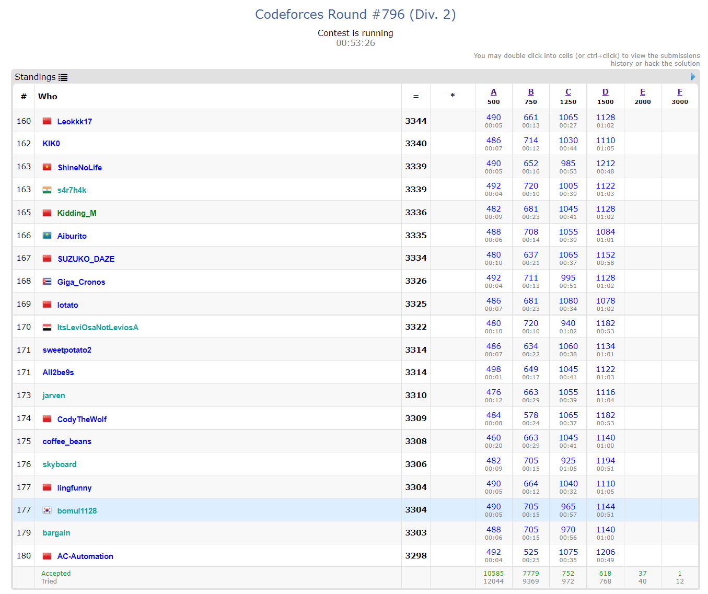

# 0603

간만에 진심 코드포스 대회를 나가보자.

...그전에 시간이 좀 남으니 새로 배워야 할 알고리즘을 정리해보자.

- 최대 유량 (포드 폴커슨, 에드몬드 카프)
- 고속 푸리에 변환 FFT (쿨리 튜키)
- 세그먼트 트리 (리차오, 느리게 갱신, 등등 세그먼트 트리는 공부할 게 한 가득인 듯)
- 헝가리안
- 호프 크로프트 카프 복습

이거만 익히면 웬만한 테크닉은 다 익힌 듯....

## Codeforces Round #796

대회 끝나기 1시간 전... 자체 종료를 했다. E번은 `flush` 함수 쓰는 거고, F번은 세그트리 문제였다.

A, B는 별 거 아니었고, C랑 D를 재밌게 풀었다. C는 O(n), D는 O(1) 풀이다.

C는 처음과 끝, 그리고 중간 변환 과정 문자열에 사용된 각각 문자의 횟수가 짝수라는 점을 알아차렸다. 그래서 문제에서 주어지지 않은 처음을 제외한 모든 문자들의 사용 횟수를 카운팅 해 홀수 횟수 쓴 애를 출력해줬다.

D는 문제 말이 어려울 뿐이었다. 생각해보니, **어떤 지점을 마지막으로 방문한 시점에 버섯이 추가로 얼마나 자랐는지를 생각해보면 되는 문제였다.** 이 정도만 써놔도 다음에 다시 볼 때 이해할 수 있을 듯.

진짜 오랜만에 4 sol이라 설렌다. 플젝 기간 때 대충 하느라 점수 떨어트려 놓지만 않았어도 purple 갔을 거 같은데... 암튼 blue 복귀는 확정인 듯 ㅎㅎ